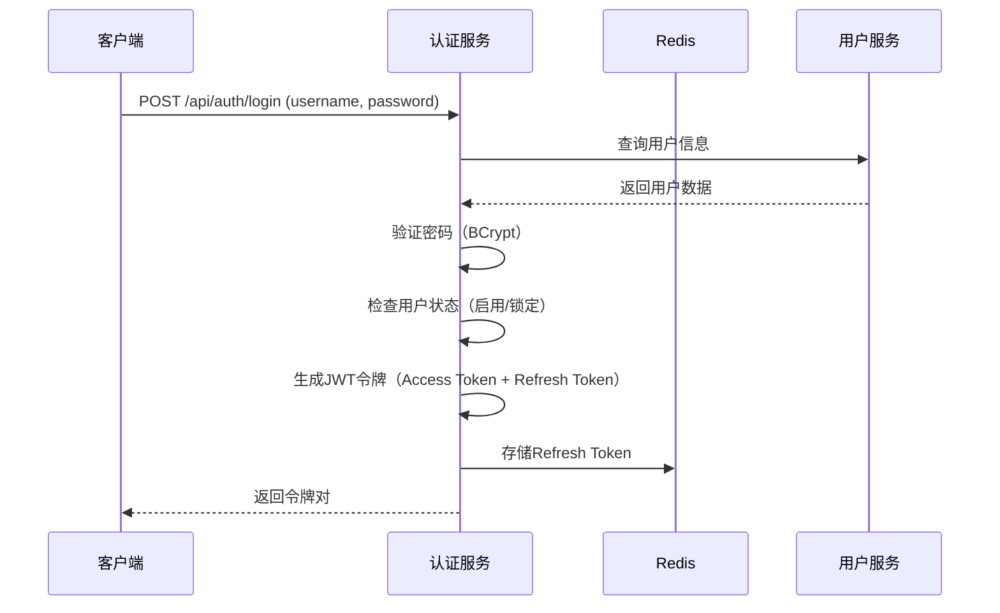
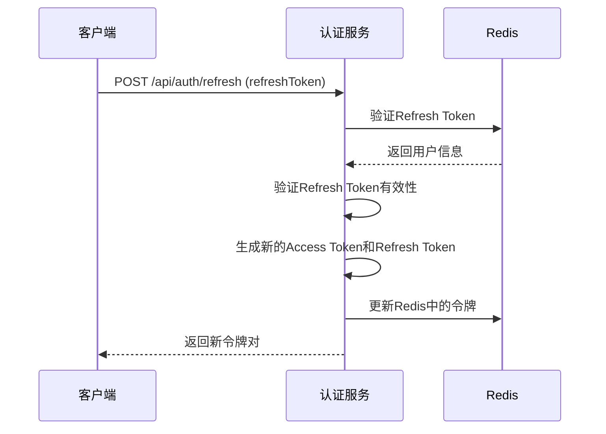
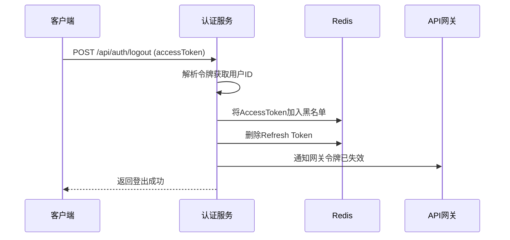

# qooerp-auth 认证服务 - 业务设计文档

> 模块版本：1.0.0-SNAPSHOT
> 创建日期：20xx-xx-xx
> 文档作者：QooERP团队

---

## 一、业务概述

### 1.1 模块定位

qooerp-auth是QooERP系统的认证授权核心服务，负责：
- 用户身份认证（登录、登出）
- 令牌管理（JWT令牌生成、验证、刷新、吊销）
- 第三方登录集成
- 多因素认证（MFA）
- 登录安全防护

### 1.2 业务目标

| 目标 | 描述 |
|------|------|
| 安全性 | 提供企业级安全保障，支持多种认证方式 |
| 可扩展性 | 支持多种登录方式扩展（OAuth2.0、OIDC、第三方） |
| 高可用性 | 支持分布式部署，无状态认证 |
| 性能 | 令牌验证性能优异，支持高并发 |

---

## 二、业务流程

### 2.1 用户登录流程



### 2.2 令牌刷新流程



### 2.3 用户登出流程



---

## 三、核心业务功能

### 3.1 用户登录

| 功能点 | 描述 | 优先级 | 状态 |
|--------|------|--------|------|
| 用户名密码登录 | 传统账号密码登录 | P0 | 进行中 |
| 手机号验证码登录 | 短信验证码登录 | P1 | 未开始 |
| 邮箱验证码登录 | 邮箱验证码登录 | P1 | 未开始 |

#### 3.1.1 登录接口规范

**请求参数**
```json
{
  "username": "admin",
  "password": "******",
  "captcha": "abc123",
  "captchaKey": "captcha_key_123"
}
```

**响应结果**
```json
{
  "code": 200,
  "message": "登录成功",
  "data": {
    "accessToken": "eyJhbGciOiJIUzI1NiIsInR5cCI6IkpXVCJ9...",
    "refreshToken": "eyJhbGciOiJIUzI1NiIsInR5cCI6IkpXVCJ9...",
    "tokenType": "Bearer",
    "expiresIn": 7200
  }
}
```

### 3.2 JWT令牌管理

| 功能点 | 描述 | 优先级 | 状态 |
|--------|------|--------|------|
| 令牌生成 | 生成Access Token和Refresh Token | P0 | 已完成 |
| 令牌验证 | 验证令牌有效性和权限 | P0 | 已完成 |
| 令牌刷新 | 刷新过期令牌 | P0 | 已完成 |
| 令牌吊销 | 登出时吊销令牌 | P0 | 已完成 |

#### 3.2.1 令牌设计

**Access Token**
- 有效期：2小时
- 格式：JWT
- 包含信息：userId、username、roles、permissions、tenantId

**Refresh Token**
- 有效期：7天
- 存储位置：Redis
- 作用：刷新Access Token

### 3.3 SSO单点登录

| 功能点 | 描述 | 优先级 | 状态 |
|--------|------|--------|------|
| OAuth2.0集成 | 支持Authorization Code模式 | P1 | 未开始 |
| OIDC集成 | OpenID Connect协议支持 | P1 | 未开始 |

### 3.4 MFA多因素认证

| 功能点 | 描述 | 优先级 | 状态 |
|--------|------|--------|------|
| 短信验证码 | 登录时短信二次验证 | P2 | 未开始 |
| TOTP密钥 | Google Authenticator等 | P2 | 未开始 |
| 邮箱验证码 | 登录时邮箱二次验证 | P2 | 未开始 |

### 3.5 第三方登录

| 功能点 | 描述 | 优先级 | 状态 |
|--------|------|--------|------|
| 微信登录 | 微信开放平台OAuth2.0 | P2 | 未开始 |
| 钉钉登录 | 钉钉开放平台OAuth2.0 | P2 | 未开始 |
| 企业微信登录 | 企业微信OAuth2.0 | P2 | 未开始 |

### 3.6 登录安全

| 功能点 | 描述 | 优先级 | 状态 |
|--------|------|--------|------|
| 登录失败限制 | 连续失败锁定账户 | P0 | 进行中 |
| IP封禁 | 恶意IP封禁 | P1 | 未开始 |
| 设备管理 | 设备绑定与验证 | P1 | 未开始 |

---

## 四、业务规则

### 4.1 密码规则

| 规则 | 说明 |
|------|------|
| 最小长度 | 8位 |
| 复杂度要求 | 必须包含大小写字母、数字 |
| 存储方式 | BCrypt加密存储 |
| 过期策略 | 90天强制修改 |

### 4.2 令牌规则

| 规则 | 说明 |
|------|------|
| Access Token有效期 | 2小时 |
| Refresh Token有效期 | 7天 |
| 令牌续期 | Refresh Token可续期1次 |
| 黑名单时间 | 令牌吊销后缓存2小时 |

### 4.3 登录限制规则

| 规则 | 说明 |
|------|------|
| 连续失败次数 | 5次锁定30分钟 |
| IP失败限制 | 单IP 10次/小时锁定 |
| 并发登录 | 同一账号最多3个设备同时在线 |

---

## 五、异常处理

### 5.1 登录失败场景

| 错误码 | 错误信息 | 处理方式 |
|--------|---------|---------|
| AUTH_001 | 用户不存在 | 提示用户注册 |
| AUTH_002 | 密码错误 | 提示密码错误，记录失败次数 |
| AUTH_003 | 账户已锁定 | 提示账户锁定时间 |
| AUTH_004 | 验证码错误 | 提示验证码错误 |
| AUTH_005 | 验证码已过期 | 提示重新获取 |

### 5.2 令牌异常场景

| 错误码 | 错误信息 | 处理方式 |
|--------|---------|---------|
| AUTH_101 | 令牌无效 | 返回401，提示重新登录 |
| AUTH_102 | 令牌已过期 | 返回401，提示刷新令牌 |
| AUTH_103 | 令牌已吊销 | 返回401，提示重新登录 |
| AUTH_104 | Refresh Token无效 | 返回401，提示重新登录 |

---

## 六、扩展点设计

### 6.1 登录方式扩展

通过`LoginStrategy`接口扩展登录方式：

```java
public interface LoginStrategy {
    LoginResponse login(LoginRequest request);
    boolean supports(LoginType type);
}
```

### 6.2 令牌存储扩展

通过`TokenStore`接口扩展令牌存储方式：

```java
public interface TokenStore {
    void storeRefreshToken(String userId, String token);
    String getRefreshToken(String userId);
    void removeRefreshToken(String userId);
}
```

---

## 七、业务指标

| 指标 | 目标值 |
|------|--------|
| 登录成功率 | >99.9% |
| 登录响应时间 | <200ms |
| 令牌验证时间 | <10ms |
| 令牌刷新成功率 | >99.9% |
| 并发登录能力 | >10000 TPS |

---

## 八、参考资料

- [RFC 6749 - OAuth 2.0](https://tools.ietf.org/html/rfc6749)
- [RFC 7519 - JSON Web Token (JWT)](https://tools.ietf.org/html/rfc7519)
- [OpenID Connect Core 1.0](https://openid.net/specs/openid-connect-core-1_0.html)
