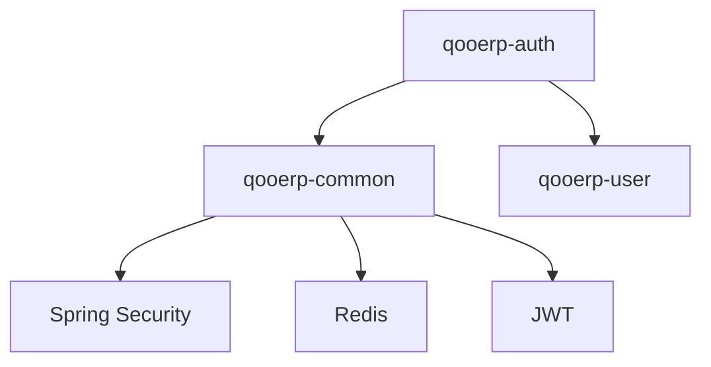

# qooerp-auth 认证服务 - 应用设计文档

> 模块版本：1.0.0-SNAPSHOT
> 创建日期：20xx-xx-xx
> 文档作者：QooERP团队

---

## 一、应用架构

### 1.1 分层架构

```
┌─────────────────────────────────────────────────┐
│                  Controller层                   │
│  AuthController - 认证接口控制器                │
└─────────────────────────────────────────────────┘
                        ↓
┌─────────────────────────────────────────────────┐
│                  Service层                      │
│  AuthService - 认证业务逻辑接口                 │
│  AuthServiceImpl - 认证业务逻辑实现              │
│  TokenService - 令牌管理服务                   │
│  LoginLogService - 登录日志服务                │
└─────────────────────────────────────────────────┘
                        ↓
┌─────────────────────────────────────────────────┐
│                  Mapper层                       │
│  UserMapper - 用户数据访问                      │
│  LoginLogMapper - 登录日志数据访问             │
└─────────────────────────────────────────────────┘
                        ↓
┌─────────────────────────────────────────────────┐
│                  Entity层                       │
│  User - 用户实体                                │
│  LoginLog - 登录日志实体                        │
└─────────────────────────────────────────────────┘
```

### 1.2 模块依赖



---

## 二、包结构

### 2.1 目录结构

```
qooerp-auth/
├── qooerp-auth-api/              # API接口层
│   └── com/qoobot/auth/api/
│       ├── dto/                  # 数据传输对象
│       │   ├── LoginRequest.java
│       │   ├── LoginResponse.java
│       │   ├── RefreshTokenRequest.java
│       │   └── TokenResponse.java
│       └── vo/                   # 视图对象
│           └── UserInfoVO.java
│
├── qooerp-auth-service/          # 服务实现层
│   ├── src/main/java/com/qoobot/auth/
│   │   ├── controller/           # 控制器层
│   │   │   └── AuthController.java
│   │   ├── service/              # 服务层
│   │   │   ├── AuthService.java
│   │   │   ├── AuthServiceImpl.java
│   │   │   ├── TokenService.java
│   │   │   └── LoginLogService.java
│   │   ├── mapper/               # 数据访问层
│   │   │   ├── UserMapper.java
│   │   │   └── LoginLogMapper.java
│   │   ├── entity/               # 实体层
│   │   │   ├── User.java
│   │   │   └── LoginLog.java
│   │   ├── config/               # 配置类
│   │   │   ├── SecurityConfig.java
│   │   │   ├── RedisConfig.java
│   │   │   └── JwtConfig.java
│   │   ├── util/                 # 工具类
│   │   │   └── JwtUtil.java
│   │   ├── exception/            # 异常类
│   │   │   ├── AuthException.java
│   │   │   └── LoginFailedException.java
│   │   ├── strategy/             # 策略模式
│   │   │   ├── LoginStrategy.java
│   │   │   └── impl/
│   │   │       ├── UsernamePasswordLoginStrategy.java
│   │   │       ├── SmsLoginStrategy.java
│   │   │       └── EmailLoginStrategy.java
│   │   └── constants/            # 常量类
│   │       ├── AuthConstant.java
│   │       └── TokenConstant.java
│   │
│   └── src/main/resources/
│       ├── application.yml       # 应用配置
│       ├── application-dev.yml  # 开发环境配置
│       ├── application-test.yml # 测试环境配置
│       └── db/migration/         # 数据库迁移脚本
│           └── V1.0.0__init_schema.sql
│
└── qooerp-auth-start/            # 启动模块
    └── src/main/java/com/qoobot/auth/
        └── AuthApplication.java
```

---

## 三、核心类设计

### 3.1 Controller层

#### AuthController

```java
@RestController
@RequestMapping("/api/auth")
public class AuthController {

    @PostMapping("/login")
    public Result<LoginResponse> login(@RequestBody LoginRequest request);

    @PostMapping("/logout")
    public Result<Void> logout(@RequestHeader("Authorization") String token);

    @PostMapping("/refresh")
    public Result<TokenResponse> refresh(@RequestBody RefreshTokenRequest request);

    @GetMapping("/validate")
    public Result<Boolean> validate(@RequestHeader("Authorization") String token);

    @GetMapping("/current")
    public Result<UserInfoVO> getCurrentUser();
}
```

### 3.2 Service层

#### AuthService

```java
public interface AuthService {

    /**
     * 用户登录
     */
    LoginResponse login(LoginRequest request);

    /**
     * 用户登出
     */
    void logout(String token);

    /**
     * 刷新令牌
     */
    TokenResponse refresh(String refreshToken);

    /**
     * 验证令牌
     */
    boolean validateToken(String token);

    /**
     * 获取当前用户信息
     */
    UserInfoVO getCurrentUser(String token);
}
```

#### AuthServiceImpl

```java
@Service
public class AuthServiceImpl implements AuthService {

    @Autowired
    private UserMapper userMapper;

    @Autowired
    private PasswordEncoder passwordEncoder;

    @Autowired
    private JwtUtil jwtUtil;

    @Autowired
    private TokenService tokenService;

    @Autowired
    private LoginLogService loginLogService;

    @Override
    @Transactional
    public LoginResponse login(LoginRequest request) {
        // 1. 参数校验
        // 2. 查询用户
        // 3. 验证密码
        // 4. 检查用户状态
        // 5. 生成令牌
        // 6. 记录登录日志
        // 7. 返回结果
    }

    // ... 其他方法实现
}
```

### 3.3 Entity层

#### User

```java
@Data
@TableName("sys_user")
public class User extends BaseEntity {

    /**
     * 用户ID
     */
    @TableId(type = IdType.ASSIGN_ID)
    private Long userId;

    /**
     * 用户名
     */
    private String username;

    /**
     * 密码（BCrypt加密）
     */
    private String password;

    /**
     * 手机号
     */
    private String phone;

    /**
     * 邮箱
     */
    private String email;

    /**
     * 真实姓名
     */
    private String realName;

    /**
     * 用户状态：0-禁用 1-启用
     */
    private Integer status;

    /**
     * 账户锁定时间
     */
    private LocalDateTime lockTime;

    /**
     * 登录失败次数
     */
    private Integer failedCount;
}
```

#### LoginLog

```java
@Data
@TableName("sys_login_log")
public class LoginLog extends BaseEntity {

    /**
     * 日志ID
     */
    @TableId(type = IdType.ASSIGN_ID)
    private Long logId;

    /**
     * 用户ID
     */
    private Long userId;

    /**
     * 用户名
     */
    private String username;

    /**
     * 登录IP
     */
    private String loginIp;

    /**
     * 登录地点
     */
    private String loginLocation;

    /**
     * 浏览器类型
     */
    private String browser;

    /**
     * 操作系统
     */
    private String os;

    /**
     * 登录状态：0-失败 1-成功
     */
    private Integer status;

    /**
     * 登录消息
     */
    private String message;
}
```

---

## 四、配置设计

### 4.1 application.yml

```yaml
server:
  port: 8081
  servlet:
    context-path: /auth

spring:
  application:
    name: qooerp-auth-service

  datasource:
    driver-class-name: org.postgresql.Driver
    url: jdbc:postgresql://localhost:5432/qooerp_auth
    username: qooerp
    password: qooerp123

  data:
    redis:
      host: localhost
      port: 6379
      password:
      database: 0
      timeout: 5000ms
      lettuce:
        pool:
          max-active: 8
          max-idle: 8
          min-idle: 0
          max-wait: -1ms

mybatis-plus:
  mapper-locations: classpath*:mapper/**/*Mapper.xml
  type-aliases-package: com.qoobot.qooerp.auth.entity
  configuration:
    map-underscore-to-camel-case: true
    cache-enabled: false
    log-impl: org.apache.ibatis.logging.stdout.StdOutImpl

# JWT配置
jwt:
  secret: qooerp-auth-secret-key-2026
  access-token-expiration: 7200000    # 2小时
  refresh-token-expiration: 604800000  # 7天
  issuer: qooerp-auth

# 登录安全配置
auth:
  login:
    max-failed-count: 5      # 最大失败次数
    lock-duration: 1800      # 锁定时长（秒）
    ip-max-failed: 10        # IP最大失败次数
    ip-lock-duration: 3600   # IP锁定时长（秒）

# 日志配置
logging:
  level:
    com.qoobot.qooerp.auth: DEBUG
    com.qoobot.qooerp.auth.mapper: DEBUG
```

---

## 五、缓存设计

### 5.1 Redis缓存Key设计

| 缓存Key | 类型 | 过期时间 | 说明 |
|---------|------|---------|------|
| auth:refresh_token:{userId} | String | 7天 | Refresh Token |
| auth:blacklist:{token} | String | 2小时 | 令牌黑名单 |
| auth:failed_count:{username} | String | 30分钟 | 登录失败次数 |
| auth:failed_ip:{ip} | String | 1小时 | IP失败次数 |
| auth:user_info:{userId} | Hash | 2小时 | 用户信息缓存 |

### 5.2 缓存操作

```java
@Service
public class TokenService {

    @Autowired
    private RedisTemplate<String, String> redisTemplate;

    /**
     * 存储Refresh Token
     */
    public void storeRefreshToken(Long userId, String refreshToken) {
        String key = String.format("auth:refresh_token:%d", userId);
        redisTemplate.opsForValue().set(key, refreshToken, 7, TimeUnit.DAYS);
    }

    /**
     * 获取Refresh Token
     */
    public String getRefreshToken(Long userId) {
        String key = String.format("auth:refresh_token:%d", userId);
        return redisTemplate.opsForValue().get(key);
    }

    /**
     * 删除Refresh Token
     */
    public void removeRefreshToken(Long userId) {
        String key = String.format("auth:refresh_token:%d", userId);
        redisTemplate.delete(key);
    }

    /**
     * 将令牌加入黑名单
     */
    public void addToBlacklist(String token) {
        String key = String.format("auth:blacklist:%s", token);
        redisTemplate.opsForValue().set(key, "1", 2, TimeUnit.HOURS);
    }

    /**
     * 检查令牌是否在黑名单
     */
    public boolean isBlacklisted(String token) {
        String key = String.format("auth:blacklist:%s", token);
        return Boolean.TRUE.equals(redisTemplate.hasKey(key));
    }
}
```

---

## 六、安全设计

### 6.1 密码加密

使用BCrypt算法加密密码：

```java
@Service
public class PasswordService {

    @Autowired
    private PasswordEncoder passwordEncoder;

    /**
     * 加密密码
     */
    public String encode(String rawPassword) {
        return passwordEncoder.encode(rawPassword);
    }

    /**
     * 验证密码
     */
    public boolean matches(String rawPassword, String encodedPassword) {
        return passwordEncoder.matches(rawPassword, encodedPassword);
    }
}
```

### 6.2 JWT令牌设计

```java
@Component
public class JwtUtil {

    @Value("${jwt.secret}")
    private String secret;

    @Value("${jwt.access-token-expiration}")
    private Long accessTokenExpiration;

    @Value("${jwt.refresh-token-expiration}")
    private Long refreshTokenExpiration;

    /**
     * 生成Access Token
     */
    public String generateAccessToken(User user) {
        Map<String, Object> claims = new HashMap<>();
        claims.put("userId", user.getUserId());
        claims.put("username", user.getUsername());
        claims.put("tenantId", user.getTenantId());
        return createToken(claims, accessTokenExpiration);
    }

    /**
     * 生成Refresh Token
     */
    public String generateRefreshToken(Long userId) {
        Map<String, Object> claims = new HashMap<>();
        claims.put("userId", userId);
        claims.put("type", "refresh");
        return createToken(claims, refreshTokenExpiration);
    }

    /**
     * 验证令牌
     */
    public boolean validateToken(String token) {
        try {
            Jwts.parser().setSigningKey(secret).parseClaimsJws(token);
            return true;
        } catch (Exception e) {
            return false;
        }
    }

    /**
     * 从令牌中获取用户ID
     */
    public Long getUserIdFromToken(String token) {
        Claims claims = getClaimsFromToken(token);
        return claims.get("userId", Long.class);
    }

    /**
     * 检查令牌是否过期
     */
    public boolean isTokenExpired(String token) {
        Claims claims = getClaimsFromToken(token);
        Date expiration = claims.getExpiration();
        return expiration.before(new Date());
    }
}
```

---

## 七、异常处理

### 7.1 自定义异常

```java
public class AuthException extends RuntimeException {
    private String code;

    public AuthException(String code, String message) {
        super(message);
        this.code = code;
    }

    public AuthException(String message) {
        super(message);
        this.code = "AUTH_ERROR";
    }
}

public class LoginFailedException extends AuthException {
    public LoginFailedException(String message) {
        super("AUTH_002", message);
    }
}
```

### 7.2 全局异常处理

```java
@RestControllerAdvice
public class AuthExceptionHandler {

    @ExceptionHandler(LoginFailedException.class)
    public Result<Void> handleLoginFailedException(LoginFailedException e) {
        return Result.fail(e.getCode(), e.getMessage());
    }

    @ExceptionHandler(AuthException.class)
    public Result<Void> handleAuthException(AuthException e) {
        return Result.fail(e.getCode(), e.getMessage());
    }

    @ExceptionHandler(Exception.class)
    public Result<Void> handleException(Exception e) {
        log.error("系统异常", e);
        return Result.fail("AUTH_999", "系统异常");
    }
}
```

---

## 八、接口文档

详见：[03-API接口文档.md](./03-API接口文档.md)

---

## 九、参考资料

- [Spring Security官方文档](https://docs.spring.io/spring-security/reference/)
- [JWT官方规范](https://jwt.io/)
- [MyBatis-Plus官方文档](https://baomidou.com/)
