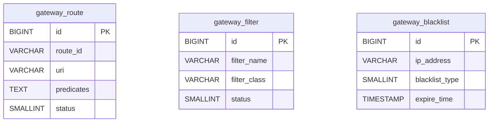

# qooerp-gateway 网关服务 - 数据设计文档

> 模块版本：1.0.0-SNAPSHOT
> 创建日期：2026-02-17
> 文档作者：QooERP团队

---

## 一、数据库概述

### 1.1 数据库信息

| 项目 | 值 |
|------|-----|
| 数据库名称 | qooerp_gateway |
| 数据库类型 | PostgreSQL 15+ |
| 字符集 | UTF8 |
| 排序规则 | zh_CN.UTF-8 |

### 1.2 表清单

| 序号 | 表名 | 中文名 | 说明 |
|------|------|--------|------|
| 1 | gateway_route | 路由表 | 存储路由配置 |
| 2 | gateway_filter | 过滤器表 | 存储过滤器配置 |
| 3 | gateway_blacklist | 黑名单表 | 存储IP黑名单 |

---

## 二、数据表设计

### 2.1 gateway_route 路由表

#### 2.1.1 表结构

| 序号 | 字段名 | 类型 | 长度 | 允许NULL | 默认值 | 主键 | 说明 |
|------|--------|------|------|----------|--------|------|------|
| 1 | id | BIGINT | 20 | NO | | YES | 路由ID |
| 2 | route_id | VARCHAR | 100 | NO | | NO | 路由ID（唯一） |
| 3 | route_name | VARCHAR | 100 | NO | | NO | 路由名称 |
| 4 | uri | VARCHAR | 500 | NO | | NO | 目标URI |
| 5 | predicates | TEXT | | YES | | NO | 断言配置（JSON） |
| 6 | filters | TEXT | | YES | | NO | 过滤器配置（JSON） |
| 7 | order_num | INT | 11 | YES | 0 | NO | 排序号 |
| 8 | status | TINYINT | 1 | NO | 1 | NO | 状态：0-禁用 1-启用 |
| 9 | remark | VARCHAR | 500 | YES | | NO | 备注 |
| 10 | create_time | TIMESTAMP | | NO | CURRENT_TIMESTAMP | NO | 创建时间 |
| 11 | create_by | VARCHAR | 50 | YES | | NO | 创建人 |
| 12 | update_time | TIMESTAMP | | NO | CURRENT_TIMESTAMP | NO | 更新时间 |
| 13 | update_by | VARCHAR | 50 | YES | | NO | 更新人 |

#### 2.1.2 建表SQL

```sql
CREATE TABLE gateway_route (
    id BIGSERIAL PRIMARY KEY,
    route_id VARCHAR(100) NOT NULL,
    route_name VARCHAR(100) NOT NULL,
    uri VARCHAR(500) NOT NULL,
    predicates TEXT,
    filters TEXT,
    order_num INTEGER DEFAULT 0,
    status SMALLINT NOT NULL DEFAULT 1,
    remark VARCHAR(500),
    create_time TIMESTAMP NOT NULL DEFAULT CURRENT_TIMESTAMP,
    create_by VARCHAR(50),
    update_time TIMESTAMP NOT NULL DEFAULT CURRENT_TIMESTAMP,
    update_by VARCHAR(50)
);

CREATE UNIQUE INDEX uk_gateway_route_id ON gateway_route(route_id);
COMMENT ON TABLE gateway_route IS '路由表';
```

---

### 2.2 gateway_filter 过滤器表

#### 2.2.1 表结构

| 序号 | 字段名 | 类型 | 长度 | 允许NULL | 默认值 | 主键 | 说明 |
|------|--------|------|------|----------|--------|------|------|
| 1 | id | BIGINT | 20 | NO | | YES | 过滤器ID |
| 2 | filter_name | VARCHAR | 100 | NO | | NO | 过滤器名称 |
| 3 | filter_class | VARCHAR | 200 | NO | | NO | 过滤器类名 |
| 4 | filter_order | INT | 11 | YES | 0 | NO | 过滤器顺序 |
| 5 | status | TINYINT | 1 | NO | 1 | NO | 状态：0-禁用 1-启用 |
| 6 | remark | VARCHAR | 500 | YES | | NO | 备注 |

#### 2.2.2 建表SQL

```sql
CREATE TABLE gateway_filter (
    id BIGSERIAL PRIMARY KEY,
    filter_name VARCHAR(100) NOT NULL,
    filter_class VARCHAR(200) NOT NULL,
    filter_order INTEGER DEFAULT 0,
    status SMALLINT NOT NULL DEFAULT 1,
    remark VARCHAR(500)
);

COMMENT ON TABLE gateway_filter IS '过滤器表';
```

---

### 2.3 gateway_blacklist 黑名单表

#### 2.3.1 表结构

| 序号 | 字段名 | 类型 | 长度 | 允许NULL | 默认值 | 主键 | 说明 |
|------|--------|------|------|----------|--------|------|------|
| 1 | id | BIGINT | 20 | NO | | YES | 主键ID |
| 2 | ip_address | VARCHAR(50 | NO | | NO | IP地址 |
| 3 | blacklist_type | TINYINT | 1 | NO | 1 | NO | 黑名单类型：1-永久 2-临时 |
| 4 | expire_time | TIMESTAMP | | YES | | NO | 过期时间 |
| 5 | reason | VARCHAR | 500 | YES | | NO | 原因 |
| 6 | create_time | TIMESTAMP | | NO | CURRENT_TIMESTAMP | NO | 创建时间 |
| 7 | create_by | VARCHAR | 50 | YES | | NO | 创建人 |

#### 2.3.2 建表SQL

```sql
CREATE TABLE gateway_blacklist (
    id BIGSERIAL PRIMARY KEY,
    ip_address VARCHAR(50) NOT NULL,
    blacklist_type SMALLINT NOT NULL DEFAULT 1,
    expire_time TIMESTAMP,
    reason VARCHAR(500),
    create_time TIMESTAMP NOT NULL DEFAULT CURRENT_TIMESTAMP,
    create_by VARCHAR(50)
);

CREATE INDEX idx_gateway_blacklist_ip ON gateway_blacklist(ip_address);
CREATE INDEX idx_gateway_blacklist_expire ON gateway_blacklist(expire_time);
COMMENT ON TABLE gateway_blacklist IS '黑名单表';
```

---

## 三、初始化数据

```sql
-- 插入默认路由
INSERT INTO gateway_route (route_id, route_name, uri, predicates, order_num, create_by) VALUES
('qooerp-auth', '认证服务', 'lb://qooerp-auth-service', '[{"name":"Path","args":{"pattern":"/api/auth/**"}}]', 1, 'system'),
('qooerp-user', '用户服务', 'lb://qooerp-user-service', '[{"name":"Path","args":{"pattern":"/api/user/**"}}]', 2, 'system'),
('qooerp-permission', '权限服务', 'lb://qooerp-permission-service', '[{"name":"Path","args":{"pattern":"/api/permission/**"}}]', 3, 'system'),
('qooerp-system', '系统管理', 'lb://qooerp-system-service', '[{"name":"Path","args":{"pattern":"/api/system/**"}}]', 4, 'system');
```

---

## 四、数据关系



---

## 五、参考资料

- [PostgreSQL官方文档](https://www.postgresql.org/docs/)
- [Spring Cloud Gateway](https://spring.io/projects/spring-cloud-gateway)
