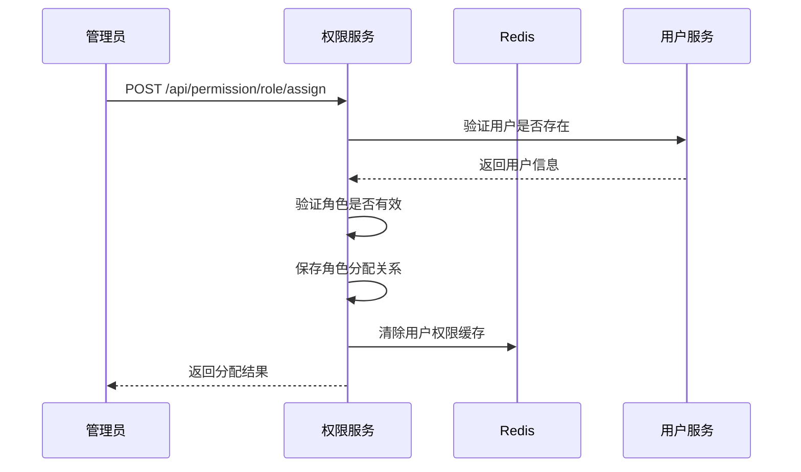
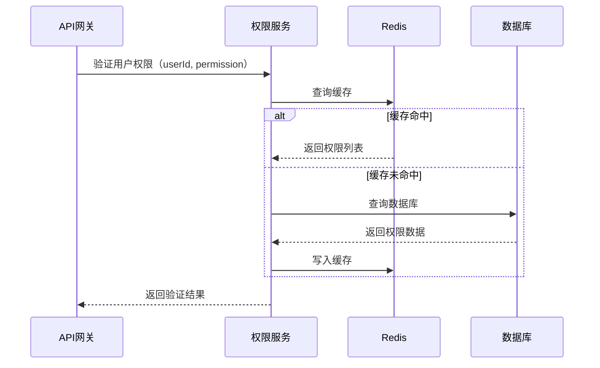

# qooerp-permission 权限服务 - 业务设计文档

> 模块版本：1.0.0-SNAPSHOT
> 创建日期：20xx-xx-xx
> 文档作者：QooERP团队

---

## 一、业务概述

### 1.1 模块定位

qooerp-permission是QooERP系统的权限管理核心服务，负责：
- 角色管理（创建、编辑、删除、分配）
- 权限管理（菜单权限、按钮权限、数据权限）
- 用户角色分配
- 角色权限分配
- 数据权限控制（部门、个人、全部等）
- 权限验证和缓存

### 1.2 业务目标

| 目标 | 描述 |
|------|------|
| 灵活性 | 支持RBAC模型，权限配置灵活 |
| 性能 | 权限缓存，验证性能优异 |
| 安全性 | 数据权限隔离，防止越权 |
| 易用性 | 可视化权限配置，操作便捷 |

---

## 二、业务流程

### 2.1 角色分配流程



### 2.2 权限验证流程



---

## 三、核心业务功能

### 3.1 角色管理

| 功能点 | 描述 | 优先级 | 状态 |
|--------|------|--------|------|
| 角色创建 | 创建新角色 | P0 | 未开始 |
| 角色编辑 | 编辑角色信息 | P0 | 未开始 |
| 角色删除 | 删除角色（软删除） | P0 | 未开始 |
| 角色查询 | 分页查询角色列表 | P0 | 未开始 |
| 角色启用/禁用 | 控制角色状态 | P0 | 未开始 |

#### 3.1.1 角色实体定义

| 字段 | 类型 | 说明 |
|------|------|------|
| id | BIGINT | 角色ID |
| roleName | VARCHAR | 角色名称 |
| roleCode | VARCHAR | 角色编码（唯一） |
| roleType | INT | 角色类型：1-系统角色 2-业务角色 |
| status | INT | 状态：0-禁用 1-启用 |
| dataScope | INT | 数据权限范围：1-全部 2-部门 3-部门及子部门 4-本人 |

### 3.2 菜单管理

| 功能点 | 描述 | 优先级 | 状态 |
|--------|------|--------|------|
| 菜单创建 | 创建新菜单 | P0 | 未开始 |
| 菜单编辑 | 编辑菜单信息 | P0 | 未开始 |
| 菜单删除 | 删除菜单 | P0 | 未开始 |
| 菜单树查询 | 查询菜单树形结构 | P0 | 未开始 |
| 菜单排序 | 调整菜单顺序 | P0 | 未开始 |

#### 3.2.1 菜单实体定义

| 字段 | 类型 | 说明 |
|------|------|------|
| id | BIGINT | 菜单ID |
| parentId | BIGINT | 父菜单ID |
| menuName | VARCHAR | 菜单名称 |
| menuType | VARCHAR | 菜单类型：M-目录 C-菜单 F-按钮 |
| path | VARCHAR | 路由路径 |
| component | VARCHAR | 组件路径 |
| permission | VARCHAR | 权限标识 |
| icon | VARCHAR | 图标 |
| sort | INT | 排序号 |
| visible | INT | 是否显示：0-隐藏 1-显示 |

### 3.3 按钮权限管理

| 功能点 | 描述 | 优先级 | 状态 |
|--------|------|--------|------|
| 按钮创建 | 创建按钮权限 | P0 | 未开始 |
| 按钮编辑 | 编辑按钮权限 | P0 | 未开始 |
| 按钮删除 | 删除按钮权限 | P0 | 未开始 |
| 按钮分配 | 为角色分配按钮权限 | P0 | 未开始 |

### 3.4 数据权限管理

| 功能点 | 描述 | 优先级 | 状态 |
|--------|------|--------|------|
| 数据范围设置 | 设置角色数据权限范围 | P0 | 未开始 |
| 自定义数据权限 | 配置自定义部门权限 | P1 | 未开始 |
| 数据权限验证 | 查询时自动过滤数据 | P0 | 未开始 |

#### 3.4.1 数据权限范围

| 范围 | 代码 | 说明 |
|------|------|------|
| 全部数据 | 1 | 可查看所有数据 |
| 本部门 | 2 | 仅查看本部门数据 |
| 本部门及子部门 | 3 | 查看本部门及子部门数据 |
| 仅本人 | 4 | 仅查看自己创建的数据 |
| 自定义 | 5 | 自定义部门数据范围 |

---

## 四、业务规则

### 4.1 角色规则

| 规则 | 说明 |
|------|------|
| 角色编码唯一 | 同一租户内角色编码唯一 |
| 角色删除校验 | 角色下有用户时不可删除 |
| 系统角色保护 | 系统角色不可删除或修改关键属性 |
| 默认角色 | 新用户自动分配默认角色 |

### 4.2 权限规则

| 规则 | 说明 |
|------|------|
| 菜单层级 | 菜单最多支持5级 |
| 菜单路径唯一 | 同一父菜单下菜单路径唯一 |
| 权限标识唯一 | 权限标识全局唯一 |
| 超级管理员 | 超级管理员拥有所有权限 |

### 4.3 数据权限规则

| 规则 | 说明 |
|------|------|
| 数据权限叠加 | 多个数据权限取并集 |
| 部门变更同步 | 用户部门变更时自动更新数据权限 |
| 自定义权限优先 | 自定义数据权限优先级高于默认范围 |

---

## 五、异常处理

### 5.1 角色异常

| 错误码 | 错误信息 | 处理方式 |
|--------|---------|---------|
| PERM_001 | 角色编码已存在 | 提示修改编码 |
| PERM_002 | 角色下有用户，不可删除 | 提示先移除用户 |
| PERM_003 | 系统角色不可删除 | 提示权限不足 |
| PERM_004 | 角色不存在 | 提示角色已被删除 |

### 5.2 权限异常

| 错误码 | 错误信息 | 处理方式 |
|--------|---------|---------|
| PERM_101 | 权限不存在 | 提示权限无效 |
| PERM_102 | 无操作权限 | 返回403 |
| PERM_103 | 权限标识重复 | 提示修改标识 |

---

## 六、扩展点设计

### 6.1 权限提供者扩展

通过`PermissionProvider`接口扩展权限来源：

```java
public interface PermissionProvider {
    List<String> getPermissions(Long userId);
    boolean supports(String type);
}
```

### 6.2 数据权限过滤器扩展

通过`DataPermissionFilter`接口扩展数据权限过滤：

```java
public interface DataPermissionFilter {
    void applyFilter(QueryWrapper queryWrapper, Long userId);
}
```

---

## 七、业务指标

| 指标 | 目标值 |
|------|--------|
| 权限验证响应时间 | <5ms |
| 缓存命中率 | >95% |
| 角色分配成功率 | >99.9% |
| 权限缓存更新延迟 | <100ms |

---

## 八、参考资料

- [RBAC模型](https://en.wikipedia.org/wiki/Role-based_access_control)
- [Spring Security](https://docs.spring.io/spring-security/reference/)
