# qooerp-user 用户管理 - 数据模型设计文档

> 模块版本：2.0.0-REDESIGN
> 设计日期：20xx-xx-xx
> 文档作者：QooERP团队
> 设计原则：DDD领域驱动设计

---

## 一、数据库概述

### 1.1 数据库信息

| 项目 | 值 |
|------|-----|
| 数据库名称 | qooerp_user |
| 数据库类型 | PostgreSQL 15+ |
| 字符集 | UTF8 |
| 排序规则 | zh_CN.UTF-8 |
| 时区 | Asia/Shanghai |
| 连接池 | HikariCP |

### 1.2 表清单

| 序号 | 表名 | 中文名 | 说明 | 聚合 |
|------|------|--------|------|------|
| 1 | user_aggregate | 用户聚合表 | 用户聚合根数据 | User |
| 2 | user_profile | 用户档案表 | 用户档案信息 | User |
| 3 | user_account | 用户账户表 | 用户账户信息 | User |
| 4 | user_preference | 用户偏好表 | 用户偏好设置 | User |
| 5 | user_organization_relation | 用户组织关系表 | 用户组织关联关系 | User |
| 6 | user_role_relation | 用户角色关系表 | 用户角色关联关系 | User |
| 7 | user_education | 用户教育背景表 | 用户教育背景 | User |
| 8 | user_work_experience | 用户工作经历表 | 用户工作经历 | User |
| 9 | user_skill | 用户技能表 | 用户技能信息 | User |
| 10 | user_document | 用户证件表 | 用户证件信息 | User |
| 11 | user_social_account | 用户社交账号表 | 用户社交账号 | User |
| 12 | user_login_method | 用户登录方式表 | 用户登录方式 | User |
| 13 | user_password_question | 用户安全问题表 | 用户安全问题 | User |
| 14 | user_security_log | 用户安全日志表 | 用户安全日志 | User |
| 15 | user_activity_log | 用户活动日志表 | 用户活动日志 | User |
| 16 | user_operation_log | 用户操作日志表 | 用户操作日志 | User |
| 17 | user_notification | 用户通知表 | 用户通知 | User |
| 18 | user_message | 用户消息表 | 用户消息 | User |
| 19 | user_workspace_setting | 用户工作区设置表 | 用户工作区设置 | User |
| 20 | user_shortcut | 用户快捷方式表 | 用户快捷方式 | User |

---

## 二、数据表设计

### 2.1 user_aggregate 用户聚合表

#### 2.1.1 表结构

| 序号 | 字段名 | 类型 | 长度 | 允许NULL | 默认值 | 主键 | 索引 | 说明 |
|------|--------|------|------|----------|--------|------|------|------|
| 1 | id | BIGINT | 20 | NO | | YES | YES | 用户ID（聚合根标识） |
| 2 | tenant_id | BIGINT | 20 | NO | 0 | NO | YES | 租户ID |
| 3 | username | VARCHAR | 50 | NO | | NO | YES | 用户名（唯一） |
| 4 | status | VARCHAR | 20 | NO | 'ACTIVE' | NO | YES | 用户状态 |
| 5 | account_status | VARCHAR | 20 | NO | 'NORMAL' | NO | | 账户状态 |
| 6 | user_type | VARCHAR | 20 | NO | 'INTERNAL' | NO | | 用户类型 |
| 7 | is_super_admin | BOOLEAN | | NO | false | NO | | 是否超级管理员 |
| 8 | last_login_time | TIMESTAMP | | YES | | NO | | 最后登录时间 |
| 9 | last_login_ip | VARCHAR | 50 | YES | | NO | | 最后登录IP |
| 10 | login_failed_count | INTEGER | | NO | 0 | NO | | 登录失败次数 |
| 11 | locked_time | TIMESTAMP | | YES | | NO | | 账户锁定时间 |
| 12 | create_time | TIMESTAMP | | NO | CURRENT_TIMESTAMP | NO | | 创建时间 |
| 13 | create_by | VARCHAR | 50 | YES | | NO | | 创建人 |
| 14 | update_time | TIMESTAMP | | NO | CURRENT_TIMESTAMP | NO | | 更新时间 |
| 15 | update_by | VARCHAR | 50 | YES | | NO | | 更新人 |
| 16 | deleted | BOOLEAN | | NO | false | NO | YES | 删除标记 |
| 17 | version | BIGINT | | NO | 0 | NO | | 乐观锁版本号 |

#### 2.1.2 建表SQL

```sql
-- 用户聚合表
CREATE TABLE user_aggregate (
    id BIGSERIAL PRIMARY KEY,
    tenant_id BIGINT NOT NULL DEFAULT 0,
    username VARCHAR(50) NOT NULL,
    status VARCHAR(20) NOT NULL DEFAULT 'ACTIVE',
    account_status VARCHAR(20) NOT NULL DEFAULT 'NORMAL',
    user_type VARCHAR(20) NOT NULL DEFAULT 'INTERNAL',
    is_super_admin BOOLEAN NOT NULL DEFAULT false,
    last_login_time TIMESTAMP,
    last_login_ip VARCHAR(50),
    login_failed_count INTEGER NOT NULL DEFAULT 0,
    locked_time TIMESTAMP,
    create_time TIMESTAMP NOT NULL DEFAULT CURRENT_TIMESTAMP,
    create_by VARCHAR(50),
    update_time TIMESTAMP NOT NULL DEFAULT CURRENT_TIMESTAMP,
    update_by VARCHAR(50),
    deleted BOOLEAN NOT NULL DEFAULT false,
    version BIGINT NOT NULL DEFAULT 0
);

-- 创建索引
CREATE UNIQUE INDEX uk_user_aggregate_username ON user_aggregate(username, tenant_id) WHERE deleted = false;
CREATE INDEX idx_user_aggregate_tenant_id ON user_aggregate(tenant_id);
CREATE INDEX idx_user_aggregate_status ON user_aggregate(status);
CREATE INDEX idx_user_aggregate_create_time ON user_aggregate(create_time);
CREATE INDEX idx_user_aggregate_last_login_time ON user_aggregate(last_login_time);

-- 添加注释
COMMENT ON TABLE user_aggregate IS '用户聚合表';
COMMENT ON COLUMN user_aggregate.id IS '用户ID';
COMMENT ON COLUMN user_aggregate.tenant_id IS '租户ID';
COMMENT ON COLUMN user_aggregate.username IS '用户名';
COMMENT ON COLUMN user_aggregate.status IS '用户状态: ACTIVE-激活, INACTIVE-未激活, LOCKED-锁定, DELETED-已删除';
COMMENT ON COLUMN user_aggregate.account_status IS '账户状态: NORMAL-正常, LOCKED-锁定, PASSWORD_EXPIRED-密码过期, NEED_CHANGE_PASSWORD-需要修改密码';
COMMENT ON COLUMN user_aggregate.user_type IS '用户类型: INTERNAL-内部用户, EXTERNAL-外部用户, SYSTEM-系统用户';
COMMENT ON COLUMN user_aggregate.is_super_admin IS '是否超级管理员';
COMMENT ON COLUMN user_aggregate.last_login_time IS '最后登录时间';
COMMENT ON COLUMN user_aggregate.last_login_ip IS '最后登录IP';
COMMENT ON COLUMN user_aggregate.login_failed_count IS '登录失败次数';
COMMENT ON COLUMN user_aggregate.locked_time IS '账户锁定时间';
COMMENT ON COLUMN user_aggregate.version IS '乐观锁版本号';
```

---

### 2.2 user_profile 用户档案表

#### 2.2.1 表结构

| 序号 | 字段名 | 类型 | 长度 | 允许NULL | 默认值 | 主键 | 索引 | 说明 |
|------|--------|------|------|----------|--------|------|------|------|
| 1 | user_id | BIGINT | 20 | NO | | YES | YES | 用户ID（主键） |
| 2 | real_name | VARCHAR | 50 | YES | | NO | | 真实姓名 |
| 3 | nickname | VARCHAR | 50 | YES | | NO | | 昵称 |
| 4 | avatar | VARCHAR | 500 | YES | | NO | | 头像URL |
| 5 | gender | VARCHAR | 10 | NO | 'UNKNOWN' | NO | | 性别 |
| 6 | birthday | DATE | | YES | | NO | | 生日 |
| 7 | phone | VARCHAR | 20 | YES | | NO | YES | 手机号 |
| 8 | email | VARCHAR | 100 | YES | | NO | YES | 邮箱 |
| 9 | employee_no | VARCHAR | 50 | YES | | NO | YES | 员工编号 |
| 10 | hire_date | DATE | | YES | | NO | | 入职日期 |
| 11 | work_location | VARCHAR | 200 | YES | | NO | | 工作地点 |
| 12 | work_email | VARCHAR | 100 | YES | | NO | | 工作邮箱 |
| 13 | work_phone | VARCHAR | 20 | YES | | NO | | 工作电话 |
| 14 | country | VARCHAR | 50 | YES | | NO | | 国家 |
| 15 | province | VARCHAR | 50 | YES | | NO | | 省份 |
| 16 | city | VARCHAR | 50 | YES | | NO | | 城市 |
| 17 | district | VARCHAR | 50 | YES | | NO | | 区县 |
| 18 | address | VARCHAR | 500 | YES | | NO | | 详细地址 |
| 19 | postal_code | VARCHAR | 20 | YES | | NO | | 邮政编码 |
| 20 | extended_attributes | JSONB | | YES | | NO | | 扩展属性（JSON格式） |
| 21 | create_time | TIMESTAMP | | NO | CURRENT_TIMESTAMP | NO | | 创建时间 |
| 22 | update_time | TIMESTAMP | | NO | CURRENT_TIMESTAMP | NO | | 更新时间 |

#### 2.2.2 建表SQL

```sql
-- 用户档案表
CREATE TABLE user_profile (
    user_id BIGINT PRIMARY KEY,
    real_name VARCHAR(50),
    nickname VARCHAR(50),
    avatar VARCHAR(500),
    gender VARCHAR(10) NOT NULL DEFAULT 'UNKNOWN',
    birthday DATE,
    phone VARCHAR(20),
    email VARCHAR(100),
    employee_no VARCHAR(50),
    hire_date DATE,
    work_location VARCHAR(200),
    work_email VARCHAR(100),
    work_phone VARCHAR(20),
    country VARCHAR(50),
    province VARCHAR(50),
    city VARCHAR(50),
    district VARCHAR(50),
    address VARCHAR(500),
    postal_code VARCHAR(20),
    extended_attributes JSONB,
    create_time TIMESTAMP NOT NULL DEFAULT CURRENT_TIMESTAMP,
    update_time TIMESTAMP NOT NULL DEFAULT CURRENT_TIMESTAMP,

    CONSTRAINT fk_user_profile_user_id FOREIGN KEY (user_id) REFERENCES user_aggregate(id) ON DELETE CASCADE
);

-- 创建索引
CREATE UNIQUE INDEX uk_user_profile_phone ON user_profile(phone) WHERE phone IS NOT NULL;
CREATE UNIQUE INDEX uk_user_profile_email ON user_profile(email) WHERE email IS NOT NULL;
CREATE UNIQUE INDEX uk_user_profile_employee_no ON user_profile(employee_no) WHERE employee_no IS NOT NULL;
CREATE INDEX idx_user_profile_real_name ON user_profile(real_name);
CREATE INDEX idx_user_profile_create_time ON user_profile(create_time);

-- 添加注释
COMMENT ON TABLE user_profile IS '用户档案表';
COMMENT ON COLUMN user_profile.user_id IS '用户ID';
COMMENT ON COLUMN user_profile.real_name IS '真实姓名';
COMMENT ON COLUMN user_profile.nickname IS '昵称';
COMMENT ON COLUMN user_profile.avatar IS '头像URL';
COMMENT ON COLUMN user_profile.gender IS '性别: MALE-男, FEMALE-女, UNKNOWN-未知';
COMMENT ON COLUMN user_profile.birthday IS '生日';
COMMENT ON COLUMN user_profile.phone IS '手机号';
COMMENT ON COLUMN user_profile.email IS '邮箱';
COMMENT ON COLUMN user_profile.employee_no IS '员工编号';
COMMENT ON COLUMN user_profile.hire_date IS '入职日期';
COMMENT ON COLUMN user_profile.work_location IS '工作地点';
COMMENT ON COLUMN user_profile.work_email IS '工作邮箱';
COMMENT ON COLUMN user_profile.work_phone IS '工作电话';
COMMENT ON COLUMN user_profile.extended_attributes IS '扩展属性（JSON格式）';
```

---

### 2.3 user_account 用户账户表

#### 2.3.1 表结构

| 序号 | 字段名 | 类型 | 长度 | 允许NULL | 默认值 | 主键 | 索引 | 说明 |
|------|--------|------|------|----------|--------|------|------|------|
| 1 | user_id | BIGINT | 20 | NO | | YES | YES | 用户ID（主键） |
| 2 | password | VARCHAR | 255 | NO | | NO | | 密码（BCrypt加密） |
| 3 | password_last_changed_time | TIMESTAMP | | NO | CURRENT_TIMESTAMP | NO | | 密码最后修改时间 |
| 4 | password_expire_time | TIMESTAMP | | YES | | NO | | 密码过期时间 |
| 5 | need_change_password | BOOLEAN | | NO | false | NO | | 是否需要修改密码 |
| 6 | mfa_enabled | BOOLEAN | | NO | false | NO | | MFA是否启用 |
| 7 | mfa_secret | VARCHAR | 100 | YES | | NO | | MFA密钥 |
| 8 | mfa_backup_codes | TEXT | | YES | | NO | | MFA备用码（JSON数组） |
| 9 | password_history | JSONB | | YES | | NO | | 密码历史（JSON数组） |
| 10 | create_time | TIMESTAMP | | NO | CURRENT_TIMESTAMP | NO | | 创建时间 |
| 11 | update_time | TIMESTAMP | | NO | CURRENT_TIMESTAMP | NO | | 更新时间 |

#### 2.3.2 建表SQL

```sql
-- 用户账户表
CREATE TABLE user_account (
    user_id BIGINT PRIMARY KEY,
    password VARCHAR(255) NOT NULL,
    password_last_changed_time TIMESTAMP NOT NULL DEFAULT CURRENT_TIMESTAMP,
    password_expire_time TIMESTAMP,
    need_change_password BOOLEAN NOT NULL DEFAULT false,
    mfa_enabled BOOLEAN NOT NULL DEFAULT false,
    mfa_secret VARCHAR(100),
    mfa_backup_codes TEXT,
    password_history JSONB,
    create_time TIMESTAMP NOT NULL DEFAULT CURRENT_TIMESTAMP,
    update_time TIMESTAMP NOT NULL DEFAULT CURRENT_TIMESTAMP,

    CONSTRAINT fk_user_account_user_id FOREIGN KEY (user_id) REFERENCES user_aggregate(id) ON DELETE CASCADE
);

-- 创建索引
CREATE INDEX idx_user_account_mfa_enabled ON user_account(mfa_enabled);

-- 添加注释
COMMENT ON TABLE user_account IS '用户账户表';
COMMENT ON COLUMN user_account.user_id IS '用户ID';
COMMENT ON COLUMN user_account.password IS '密码（BCrypt加密）';
COMMENT ON COLUMN user_account.password_last_changed_time IS '密码最后修改时间';
COMMENT ON COLUMN user_account.password_expire_time IS '密码过期时间';
COMMENT ON COLUMN user_account.need_change_password IS '是否需要修改密码';
COMMENT ON COLUMN user_account.mfa_enabled IS 'MFA是否启用';
COMMENT ON COLUMN user_account.mfa_secret IS 'MFA密钥';
COMMENT ON COLUMN user_account.mfa_backup_codes IS 'MFA备用码（JSON数组）';
COMMENT ON COLUMN user_account.password_history IS '密码历史（JSON数组）';
```

---

### 2.4 user_preference 用户偏好表

#### 2.4.1 表结构

| 序号 | 字段名 | 类型 | 长度 | 允许NULL | 默认值 | 主键 | 索引 | 说明 |
|------|--------|------|------|----------|--------|------|------|------|
| 1 | user_id | BIGINT | 20 | NO | | YES | YES | 用户ID（主键） |
| 2 | language | VARCHAR | 10 | NO | 'zh-CN' | NO | | 语言偏好 |
| 3 | timezone | VARCHAR | 50 | NO | 'Asia/Shanghai' | NO | | 时区 |
| 4 | date_format | VARCHAR | 20 | NO | 'yyyy-MM-dd' | NO | | 日期格式 |
| 5 | time_format | VARCHAR | 20 | NO | 'HH:mm:ss' | NO | | 时间格式 |
| 6 | theme | VARCHAR | 20 | NO | 'light' | NO | | 主题 |
| 7 | home_page_layout | VARCHAR | 50 | YES | | NO | | 首页布局 |
| 8 | page_size | INTEGER | | NO | 20 | NO | | 每页显示条数 |
| 9 | notification_settings | JSONB | | YES | | NO | | 通知设置（JSON格式） |
| 10 | ui_settings | JSONB | | YES | | NO | | 界面设置（JSON格式） |
| 11 | create_time | TIMESTAMP | | NO | CURRENT_TIMESTAMP | NO | | 创建时间 |
| 12 | update_time | TIMESTAMP | | NO | CURRENT_TIMESTAMP | NO | | 更新时间 |

#### 2.4.2 建表SQL

```sql
-- 用户偏好表
CREATE TABLE user_preference (
    user_id BIGINT PRIMARY KEY,
    language VARCHAR(10) NOT NULL DEFAULT 'zh-CN',
    timezone VARCHAR(50) NOT NULL DEFAULT 'Asia/Shanghai',
    date_format VARCHAR(20) NOT NULL DEFAULT 'yyyy-MM-dd',
    time_format VARCHAR(20) NOT NULL DEFAULT 'HH:mm:ss',
    theme VARCHAR(20) NOT NULL DEFAULT 'light',
    home_page_layout VARCHAR(50),
    page_size INTEGER NOT NULL DEFAULT 20,
    notification_settings JSONB,
    ui_settings JSONB,
    create_time TIMESTAMP NOT NULL DEFAULT CURRENT_TIMESTAMP,
    update_time TIMESTAMP NOT NULL DEFAULT CURRENT_TIMESTAMP,

    CONSTRAINT fk_user_preference_user_id FOREIGN KEY (user_id) REFERENCES user_aggregate(id) ON DELETE CASCADE
);

-- 添加注释
COMMENT ON TABLE user_preference IS '用户偏好表';
COMMENT ON COLUMN user_preference.user_id IS '用户ID';
COMMENT ON COLUMN user_preference.language IS '语言偏好';
COMMENT ON COLUMN user_preference.timezone IS '时区';
COMMENT ON COLUMN user_preference.date_format IS '日期格式';
COMMENT ON COLUMN user_preference.time_format IS '时间格式';
COMMENT ON COLUMN user_preference.theme IS '主题: light-亮色, dark-暗色';
COMMENT ON COLUMN user_preference.home_page_layout IS '首页布局';
COMMENT ON COLUMN user_preference.page_size IS '每页显示条数';
COMMENT ON COLUMN user_preference.notification_settings IS '通知设置（JSON格式）';
COMMENT ON COLUMN user_preference.ui_settings IS '界面设置（JSON格式）';
```

---

### 2.5 user_organization_relation 用户组织关系表

#### 2.5.1 表结构

| 序号 | 字段名 | 类型 | 长度 | 允许NULL | 默认值 | 主键 | 索引 | 说明 |
|------|--------|------|------|----------|--------|------|------|------|
| 1 | id | BIGINT | 20 | NO | | YES | YES | 主键ID |
| 2 | user_id | BIGINT | 20 | NO | | NO | YES | 用户ID |
| 3 | org_id | BIGINT | 20 | NO | | NO | YES | 组织ID |
| 4 | org_name | VARCHAR | 100 | NO | | NO | | 组织名称 |
| 5 | is_primary | BOOLEAN | | NO | false | NO | | 是否主组织 |
| 6 | join_date | DATE | | NO | CURRENT_DATE | NO | | 入职时间 |
| 7 | leave_date | DATE | | YES | | NO | | 离职时间 |
| 8 | employment_status | VARCHAR | 20 | NO | 'ACTIVE' | NO | | 就职状态 |
| 9 | position | VARCHAR | 100 | YES | | NO | | 职位 |
| 10 | grade | VARCHAR | 50 | YES | | NO | | 职级 |
| 11 | remark | VARCHAR | 500 | YES | | NO | | 备注 |
| 12 | create_time | TIMESTAMP | | NO | CURRENT_TIMESTAMP | NO | | 创建时间 |
| 13 | update_time | TIMESTAMP | | NO | CURRENT_TIMESTAMP | NO | | 更新时间 |

#### 2.5.2 建表SQL

```sql
-- 用户组织关系表
CREATE TABLE user_organization_relation (
    id BIGSERIAL PRIMARY KEY,
    user_id BIGINT NOT NULL,
    org_id BIGINT NOT NULL,
    org_name VARCHAR(100) NOT NULL,
    is_primary BOOLEAN NOT NULL DEFAULT false,
    join_date DATE NOT NULL DEFAULT CURRENT_DATE,
    leave_date DATE,
    employment_status VARCHAR(20) NOT NULL DEFAULT 'ACTIVE',
    position VARCHAR(100),
    grade VARCHAR(50),
    remark VARCHAR(500),
    create_time TIMESTAMP NOT NULL DEFAULT CURRENT_TIMESTAMP,
    update_time TIMESTAMP NOT NULL DEFAULT CURRENT_TIMESTAMP,

    CONSTRAINT fk_user_org_rel_user_id FOREIGN KEY (user_id) REFERENCES user_aggregate(id) ON DELETE CASCADE,
    CONSTRAINT uk_user_org_rel_user_org UNIQUE(user_id, org_id)
);

-- 创建索引
CREATE INDEX idx_user_org_rel_user_id ON user_organization_relation(user_id);
CREATE INDEX idx_user_org_rel_org_id ON user_organization_relation(org_id);
CREATE INDEX idx_user_org_rel_is_primary ON user_organization_relation(is_primary);

-- 添加注释
COMMENT ON TABLE user_organization_relation IS '用户组织关系表';
COMMENT ON COLUMN user_organization_relation.id IS '主键ID';
COMMENT ON COLUMN user_organization_relation.user_id IS '用户ID';
COMMENT ON COLUMN user_organization_relation.org_id IS '组织ID';
COMMENT ON COLUMN user_organization_relation.org_name IS '组织名称';
COMMENT ON COLUMN user_organization_relation.is_primary IS '是否主组织';
COMMENT ON COLUMN user_organization_relation.join_date IS '入职时间';
COMMENT ON COLUMN user_organization_relation.leave_date IS '离职时间';
COMMENT ON COLUMN user_organization_relation.employment_status IS '就职状态: ACTIVE-在职, RESIGNED-离职, TRANSFERRED-调动, SUSPENDED-暂停';
COMMENT ON COLUMN user_organization_relation.position IS '职位';
COMMENT ON COLUMN user_organization_relation.grade IS '职级';
```

---

### 2.6 user_role_relation 用户角色关系表

#### 2.6.1 表结构

| 序号 | 字段名 | 类型 | 长度 | 允许NULL | 默认值 | 主键 | 索引 | 说明 |
|------|--------|------|------|----------|--------|------|------|------|
| 1 | id | BIGINT | 20 | NO | | YES | YES | 主键ID |
| 2 | user_id | BIGINT | 20 | NO | | NO | YES | 用户ID |
| 3 | role_id | BIGINT | 20 | NO | | NO | YES | 角色ID |
| 4 | role_name | VARCHAR | 100 | NO | | NO | | 角色名称 |
| 5 | is_primary | BOOLEAN | | NO | false | NO | | 是否主角色 |
| 6 | assigned_time | TIMESTAMP | | NO | CURRENT_TIMESTAMP | NO | | 分配时间 |
| 7 | expire_time | TIMESTAMP | | YES | | NO | | 过期时间 |
| 8 | remark | VARCHAR | 500 | YES | | NO | | 备注 |
| 9 | create_time | TIMESTAMP | | NO | CURRENT_TIMESTAMP | NO | | 创建时间 |
| 10 | update_time | TIMESTAMP | | NO | CURRENT_TIMESTAMP | NO | | 更新时间 |

#### 2.6.2 建表SQL

```sql
-- 用户角色关系表
CREATE TABLE user_role_relation (
    id BIGSERIAL PRIMARY KEY,
    user_id BIGINT NOT NULL,
    role_id BIGINT NOT NULL,
    role_name VARCHAR(100) NOT NULL,
    is_primary BOOLEAN NOT NULL DEFAULT false,
    assigned_time TIMESTAMP NOT NULL DEFAULT CURRENT_TIMESTAMP,
    expire_time TIMESTAMP,
    remark VARCHAR(500),
    create_time TIMESTAMP NOT NULL DEFAULT CURRENT_TIMESTAMP,
    update_time TIMESTAMP NOT NULL DEFAULT CURRENT_TIMESTAMP,

    CONSTRAINT fk_user_role_rel_user_id FOREIGN KEY (user_id) REFERENCES user_aggregate(id) ON DELETE CASCADE,
    CONSTRAINT uk_user_role_rel_user_role UNIQUE(user_id, role_id)
);

-- 创建索引
CREATE INDEX idx_user_role_rel_user_id ON user_role_relation(user_id);
CREATE INDEX idx_user_role_rel_role_id ON user_role_relation(role_id);
CREATE INDEX idx_user_role_rel_is_primary ON user_role_relation(is_primary);
CREATE INDEX idx_user_role_rel_expire_time ON user_role_relation(expire_time) WHERE expire_time IS NOT NULL;

-- 添加注释
COMMENT ON TABLE user_role_relation IS '用户角色关系表';
COMMENT ON COLUMN user_role_relation.id IS '主键ID';
COMMENT ON COLUMN user_role_relation.user_id IS '用户ID';
COMMENT ON COLUMN user_role_relation.role_id IS '角色ID';
COMMENT ON COLUMN user_role_relation.role_name IS '角色名称';
COMMENT ON COLUMN user_role_relation.is_primary IS '是否主角色';
COMMENT ON COLUMN user_role_relation.assigned_time IS '分配时间';
COMMENT ON COLUMN user_role_relation.expire_time IS '过期时间';
```

---

### 2.7 user_education 用户教育背景表

#### 2.7.1 表结构

| 序号 | 字段名 | 类型 | 长度 | 允许NULL | 默认值 | 主键 | 索引 | 说明 |
|------|--------|------|------|----------|--------|------|------|------|
| 1 | id | BIGINT | 20 | NO | | YES | YES | 主键ID |
| 2 | user_id | BIGINT | 20 | NO | | NO | YES | 用户ID |
| 3 | school_name | VARCHAR | 200 | NO | | NO | | 学校名称 |
| 4 | major | VARCHAR | 100 | NO | | NO | | 专业 |
| 5 | education_level | VARCHAR | 20 | NO | | NO | | 学历 |
| 6 | degree | VARCHAR | 50 | YES | | NO | | 学位 |
| 7 | start_date | DATE | | NO | | NO | | 开始时间 |
| 8 | end_date | DATE | | YES | | NO | | 结束时间 |
| 9 | is_graduated | BOOLEAN | | YES | | NO | | 是否毕业 |
| 10 | remark | VARCHAR | 500 | YES | | NO | | 备注 |
| 11 | create_time | TIMESTAMP | | NO | CURRENT_TIMESTAMP | NO | | 创建时间 |
| 12 | update_time | TIMESTAMP | | NO | CURRENT_TIMESTAMP | NO | | 更新时间 |

#### 2.7.2 建表SQL

```sql
-- 用户教育背景表
CREATE TABLE user_education (
    id BIGSERIAL PRIMARY KEY,
    user_id BIGINT NOT NULL,
    school_name VARCHAR(200) NOT NULL,
    major VARCHAR(100) NOT NULL,
    education_level VARCHAR(20) NOT NULL,
    degree VARCHAR(50),
    start_date DATE NOT NULL,
    end_date DATE,
    is_graduated BOOLEAN,
    remark VARCHAR(500),
    create_time TIMESTAMP NOT NULL DEFAULT CURRENT_TIMESTAMP,
    update_time TIMESTAMP NOT NULL DEFAULT CURRENT_TIMESTAMP,

    CONSTRAINT fk_user_edu_user_id FOREIGN KEY (user_id) REFERENCES user_aggregate(id) ON DELETE CASCADE
);

-- 创建索引
CREATE INDEX idx_user_edu_user_id ON user_education(user_id);

-- 添加注释
COMMENT ON TABLE user_education IS '用户教育背景表';
COMMENT ON COLUMN user_education.id IS '主键ID';
COMMENT ON COLUMN user_education.user_id IS '用户ID';
COMMENT ON COLUMN user_education.school_name IS '学校名称';
COMMENT ON COLUMN user_education.major IS '专业';
COMMENT ON COLUMN user_education.education_level IS '学历: HIGH_SCHOOL-高中, BACHELOR-本科, MASTER-硕士, DOCTOR-博士';
COMMENT ON COLUMN user_education.degree IS '学位';
COMMENT ON COLUMN user_education.start_date IS '开始时间';
COMMENT ON COLUMN user_education.end_date IS '结束时间';
COMMENT ON COLUMN user_education.is_graduated IS '是否毕业';
```

---

### 2.8 user_work_experience 用户工作经历表

#### 2.8.1 表结构

| 序号 | 字段名 | 类型 | 长度 | 允许NULL | 默认值 | 主键 | 索引 | 说明 |
|------|--------|------|------|----------|--------|------|------|------|
| 1 | id | BIGINT | 20 | NO | | YES | YES | 主键ID |
| 2 | user_id | BIGINT | 20 | NO | | NO | YES | 用户ID |
| 3 | company_name | VARCHAR | 200 | NO | | NO | | 公司名称 |
| 4 | position | VARCHAR | 100 | NO | | NO | | 职位 |
| 5 | start_date | DATE | | NO | | NO | | 开始时间 |
| 6 | end_date | DATE | | YES | | NO | | 结束时间 |
| 7 | is_current | BOOLEAN | | NO | false | NO | | 是否当前工作 |
| 8 | work_description | TEXT | | YES | | NO | | 工作描述 |
| 9 | remark | VARCHAR | 500 | YES | | NO | | 备注 |
| 10 | create_time | TIMESTAMP | | NO | CURRENT_TIMESTAMP | NO | | 创建时间 |
| 11 | update_time | TIMESTAMP | | NO | CURRENT_TIMESTAMP | NO | | 更新时间 |

#### 2.8.2 建表SQL

```sql
-- 用户工作经历表
CREATE TABLE user_work_experience (
    id BIGSERIAL PRIMARY KEY,
    user_id BIGINT NOT NULL,
    company_name VARCHAR(200) NOT NULL,
    position VARCHAR(100) NOT NULL,
    start_date DATE NOT NULL,
    end_date DATE,
    is_current BOOLEAN NOT NULL DEFAULT false,
    work_description TEXT,
    remark VARCHAR(500),
    create_time TIMESTAMP NOT NULL DEFAULT CURRENT_TIMESTAMP,
    update_time TIMESTAMP NOT NULL DEFAULT CURRENT_TIMESTAMP,

    CONSTRAINT fk_user_work_exp_user_id FOREIGN KEY (user_id) REFERENCES user_aggregate(id) ON DELETE CASCADE
);

-- 创建索引
CREATE INDEX idx_user_work_exp_user_id ON user_work_experience(user_id);
CREATE INDEX idx_user_work_exp_is_current ON user_work_experience(is_current);

-- 添加注释
COMMENT ON TABLE user_work_experience IS '用户工作经历表';
COMMENT ON COLUMN user_work_experience.id IS '主键ID';
COMMENT ON COLUMN user_work_experience.user_id IS '用户ID';
COMMENT ON COLUMN user_work_experience.company_name IS '公司名称';
COMMENT ON COLUMN user_work_experience.position IS '职位';
COMMENT ON COLUMN user_work_experience.start_date IS '开始时间';
COMMENT ON COLUMN user_work_experience.end_date IS '结束时间';
COMMENT ON COLUMN user_work_experience.is_current IS '是否当前工作';
COMMENT ON COLUMN user_work_experience.work_description IS '工作描述';
```

---

### 2.9 user_skill 用户技能表

#### 2.9.1 表结构

| 序号 | 字段名 | 类型 | 长度 | 允许NULL | 默认值 | 主键 | 索引 | 说明 |
|------|--------|------|------|----------|--------|------|------|------|
| 1 | id | BIGINT | 20 | NO | | YES | YES | 主键ID |
| 2 | user_id | BIGINT | 20 | NO | | NO | YES | 用户ID |
| 3 | skill_name | VARCHAR | 100 | NO | | NO | | 技能名称 |
| 4 | skill_level | VARCHAR | 20 | NO | | NO | | 技能熟练度 |
| 5 | certificate | VARCHAR | 100 | YES | | NO | | 证书 |
| 6 | remark | VARCHAR | 500 | YES | | NO | | 备注 |
| 7 | create_time | TIMESTAMP | | NO | CURRENT_TIMESTAMP | NO | | 创建时间 |
| 8 | update_time | TIMESTAMP | | NO | CURRENT_TIMESTAMP | NO | | 更新时间 |

#### 2.9.2 建表SQL

```sql
-- 用户技能表
CREATE TABLE user_skill (
    id BIGSERIAL PRIMARY KEY,
    user_id BIGINT NOT NULL,
    skill_name VARCHAR(100) NOT NULL,
    skill_level VARCHAR(20) NOT NULL,
    certificate VARCHAR(100),
    remark VARCHAR(500),
    create_time TIMESTAMP NOT NULL DEFAULT CURRENT_TIMESTAMP,
    update_time TIMESTAMP NOT NULL DEFAULT CURRENT_TIMESTAMP,

    CONSTRAINT fk_user_skill_user_id FOREIGN KEY (user_id) REFERENCES user_aggregate(id) ON DELETE CASCADE
);

-- 创建索引
CREATE INDEX idx_user_skill_user_id ON user_skill(user_id);

-- 添加注释
COMMENT ON TABLE user_skill IS '用户技能表';
COMMENT ON COLUMN user_skill.id IS '主键ID';
COMMENT ON COLUMN user_skill.user_id IS '用户ID';
COMMENT ON COLUMN user_skill.skill_name IS '技能名称';
COMMENT ON COLUMN user_skill.skill_level IS '技能熟练度: BEGINNER-初级, INTERMEDIATE-中级, ADVANCED-高级, EXPERT-专家';
COMMENT ON COLUMN user_skill.certificate IS '证书';
```

---

### 2.10 user_document 用户证件表

#### 2.10.1 表结构

| 序号 | 字段名 | 类型 | 长度 | 允许NULL | 默认值 | 主键 | 索引 | 说明 |
|------|--------|------|------|----------|--------|------|------|------|
| 1 | id | BIGINT | 20 | NO | | YES | YES | 主键ID |
| 2 | user_id | BIGINT | 20 | NO | | NO | YES | 用户ID |
| 3 | document_type | VARCHAR | 50 | NO | | NO | | 证件类型 |
| 4 | document_no | VARCHAR | 100 | NO | | NO | | 证件号码 |
| 5 | document_name | VARCHAR | 100 | YES | | NO | | 证件名称 |
| 6 | issue_date | DATE | | YES | | NO | | 发证日期 |
| 7 | expire_date | DATE | | YES | | NO | | 过期日期 |
| 8 | issuing_authority | VARCHAR | 200 | YES | | NO | | 发证机关 |
| 9 | file_url | VARCHAR | 500 | YES | | NO | | 证件文件URL |
| 10 | remark | VARCHAR | 500 | YES | | NO | | 备注 |
| 11 | create_time | TIMESTAMP | | NO | CURRENT_TIMESTAMP | NO | | 创建时间 |
| 12 | update_time | TIMESTAMP | | NO | CURRENT_TIMESTAMP | NO | | 更新时间 |

#### 2.10.2 建表SQL

```sql
-- 用户证件表
CREATE TABLE user_document (
    id BIGSERIAL PRIMARY KEY,
    user_id BIGINT NOT NULL,
    document_type VARCHAR(50) NOT NULL,
    document_no VARCHAR(100) NOT NULL,
    document_name VARCHAR(100),
    issue_date DATE,
    expire_date DATE,
    issuing_authority VARCHAR(200),
    file_url VARCHAR(500),
    remark VARCHAR(500),
    create_time TIMESTAMP NOT NULL DEFAULT CURRENT_TIMESTAMP,
    update_time TIMESTAMP NOT NULL DEFAULT CURRENT_TIMESTAMP,

    CONSTRAINT fk_user_doc_user_id FOREIGN KEY (user_id) REFERENCES user_aggregate(id) ON DELETE CASCADE,
    CONSTRAINT uk_user_doc_type_no UNIQUE(user_id, document_type, document_no)
);

-- 创建索引
CREATE INDEX idx_user_doc_user_id ON user_document(user_id);
CREATE INDEX idx_user_doc_expire_date ON user_document(expire_date) WHERE expire_date IS NOT NULL;

-- 添加注释
COMMENT ON TABLE user_document IS '用户证件表';
COMMENT ON COLUMN user_document.id IS '主键ID';
COMMENT ON COLUMN user_document.user_id IS '用户ID';
COMMENT ON COLUMN user_document.document_type IS '证件类型: ID_CARD-身份证, PASSPORT-护照, DRIVER_LICENSE-驾驶证';
COMMENT ON COLUMN user_document.document_no IS '证件号码';
COMMENT ON COLUMN user_document.issue_date IS '发证日期';
COMMENT ON COLUMN user_document.expire_date IS '过期日期';
COMMENT ON COLUMN user_document.issuing_authority IS '发证机关';
COMMENT ON COLUMN user_document.file_url IS '证件文件URL';
```

---

### 2.11 user_activity_log 用户活动日志表

#### 2.11.1 表结构

| 序号 | 字段名 | 类型 | 长度 | 允许NULL | 默认值 | 主键 | 索引 | 说明 |
|------|--------|------|------|----------|--------|------|------|------|
| 1 | id | BIGINT | 20 | NO | | YES | YES | 主键ID |
| 2 | user_id | BIGINT | 20 | NO | | NO | YES | 用户ID |
| 3 | activity_type | VARCHAR | 50 | NO | | NO | YES | 活动类型 |
| 4 | activity_description | VARCHAR | 500 | NO | | NO | | 活动描述 |
| 5 | activity_data | JSONB | | YES | | NO | | 活动数据（JSON格式） |
| 6 | ip_address | VARCHAR | 50 | YES | | NO | | IP地址 |
| 7 | user_agent | VARCHAR | 500 | YES | | NO | | 用户代理 |
| 8 | device_type | VARCHAR | 20 | YES | | NO | | 设备类型 |
| 9 | browser_type | VARCHAR | 50 | YES | | NO | | 浏览器类型 |
| 10 | os_type | VARCHAR | 50 | YES | | NO | | 操作系统 |
| 11 | location | VARCHAR | 200 | YES | | NO | | 地理位置 |
| 12 | create_time | TIMESTAMP | | NO | CURRENT_TIMESTAMP | NO | YES | 创建时间 |

#### 2.11.2 建表SQL

```sql
-- 用户活动日志表
CREATE TABLE user_activity_log (
    id BIGSERIAL PRIMARY KEY,
    user_id BIGINT NOT NULL,
    activity_type VARCHAR(50) NOT NULL,
    activity_description VARCHAR(500) NOT NULL,
    activity_data JSONB,
    ip_address VARCHAR(50),
    user_agent VARCHAR(500),
    device_type VARCHAR(20),
    browser_type VARCHAR(50),
    os_type VARCHAR(50),
    location VARCHAR(200),
    create_time TIMESTAMP NOT NULL DEFAULT CURRENT_TIMESTAMP,

    CONSTRAINT fk_user_activity_log_user_id FOREIGN KEY (user_id) REFERENCES user_aggregate(id) ON DELETE CASCADE
);

-- 创建索引
CREATE INDEX idx_user_activity_log_user_id ON user_activity_log(user_id);
CREATE INDEX idx_user_activity_log_activity_type ON user_activity_log(activity_type);
CREATE INDEX idx_user_activity_log_create_time ON user_activity_log(create_time);
CREATE INDEX idx_user_activity_log_ip_address ON user_activity_log(ip_address);

-- 添加注释
COMMENT ON TABLE user_activity_log IS '用户活动日志表';
COMMENT ON COLUMN user_activity_log.id IS '主键ID';
COMMENT ON COLUMN user_activity_log.user_id IS '用户ID';
COMMENT ON COLUMN user_activity_log.activity_type IS '活动类型: LOGIN-登录, LOGOUT-登出, PASSWORD_CHANGE-修改密码';
COMMENT ON COLUMN user_activity_log.activity_description IS '活动描述';
COMMENT ON COLUMN user_activity_log.activity_data IS '活动数据（JSON格式）';
COMMENT ON COLUMN user_activity_log.ip_address IS 'IP地址';
COMMENT ON COLUMN user_activity_log.user_agent IS '用户代理';
COMMENT ON COLUMN user_activity_log.device_type IS '设备类型: PC-电脑, MOBILE-手机, TABLET-平板';
```

---

### 2.12 user_operation_log 用户操作日志表

#### 2.12.1 表结构

| 序号 | 字段名 | 类型 | 长度 | 允许NULL | 默认值 | 主键 | 索引 | 说明 |
|------|--------|------|------|----------|--------|------|------|------|
| 1 | id | BIGINT | 20 | NO | | YES | YES | 主键ID |
| 2 | user_id | BIGINT | 20 | NO | | NO | YES | 用户ID |
| 3 | username | VARCHAR | 50 | NO | | NO | | 用户名 |
| 4 | module | VARCHAR | 50 | NO | | NO | YES | 模块名称 |
| 5 | operation | VARCHAR | 50 | NO | | NO | | 操作名称 |
| 6 | operation_type | VARCHAR | 20 | NO | | NO | | 操作类型 |
| 7 | request_method | VARCHAR | 10 | YES | | NO | | 请求方法 |
| 8 | request_url | VARCHAR | 500 | YES | | NO | | 请求URL |
| 9 | request_params | TEXT | | YES | | NO | | 请求参数 |
| 10 | response_data | TEXT | | YES | | NO | | 响应数据 |
| 11 | execute_time | BIGINT | | NO | 0 | NO | | 执行时间（毫秒） |
| 12 | status | VARCHAR | 20 | NO | 'SUCCESS' | NO | YES | 执行状态 |
| 13 | error_message | TEXT | | YES | | NO | | 错误信息 |
| 14 | ip_address | VARCHAR | 50 | YES | | NO | | IP地址 |
| 15 | user_agent | VARCHAR | 500 | YES | | NO | | 用户代理 |
| 16 | create_time | TIMESTAMP | | NO | CURRENT_TIMESTAMP | NO | YES | 创建时间 |

#### 2.12.2 建表SQL

```sql
-- 用户操作日志表
CREATE TABLE user_operation_log (
    id BIGSERIAL PRIMARY KEY,
    user_id BIGINT NOT NULL,
    username VARCHAR(50) NOT NULL,
    module VARCHAR(50) NOT NULL,
    operation VARCHAR(50) NOT NULL,
    operation_type VARCHAR(20) NOT NULL,
    request_method VARCHAR(10),
    request_url VARCHAR(500),
    request_params TEXT,
    response_data TEXT,
    execute_time BIGINT NOT NULL DEFAULT 0,
    status VARCHAR(20) NOT NULL DEFAULT 'SUCCESS',
    error_message TEXT,
    ip_address VARCHAR(50),
    user_agent VARCHAR(500),
    create_time TIMESTAMP NOT NULL DEFAULT CURRENT_TIMESTAMP,

    CONSTRAINT fk_user_op_log_user_id FOREIGN KEY (user_id) REFERENCES user_aggregate(id) ON DELETE CASCADE
);

-- 创建索引
CREATE INDEX idx_user_op_log_user_id ON user_operation_log(user_id);
CREATE INDEX idx_user_op_log_module ON user_operation_log(module);
CREATE INDEX idx_user_op_log_create_time ON user_operation_log(create_time);
CREATE INDEX idx_user_op_log_status ON user_operation_log(status);
CREATE INDEX idx_user_op_log_ip_address ON user_operation_log(ip_address);

-- 添加注释
COMMENT ON TABLE user_operation_log IS '用户操作日志表';
COMMENT ON COLUMN user_operation_log.id IS '主键ID';
COMMENT ON COLUMN user_operation_log.user_id IS '用户ID';
COMMENT ON COLUMN user_operation_log.username IS '用户名';
COMMENT ON COLUMN user_operation_log.module IS '模块名称';
COMMENT ON COLUMN user_operation_log.operation IS '操作名称';
COMMENT ON COLUMN user_operation_log.operation_type IS '操作类型: INSERT-新增, UPDATE-更新, DELETE-删除, SELECT-查询';
COMMENT ON COLUMN user_operation_log.request_method IS '请求方法: GET, POST, PUT, DELETE';
COMMENT ON COLUMN user_operation_log.request_url IS '请求URL';
COMMENT ON COLUMN user_operation_log.request_params IS '请求参数';
COMMENT ON COLUMN user_operation_log.response_data IS '响应数据';
COMMENT ON COLUMN user_operation_log.execute_time IS '执行时间（毫秒）';
COMMENT ON COLUMN user_operation_log.status IS '执行状态: SUCCESS-成功, FAILURE-失败';
COMMENT ON COLUMN user_operation_log.error_message IS '错误信息';
COMMENT ON COLUMN user_operation_log.ip_address IS 'IP地址';
COMMENT ON COLUMN user_operation_log.user_agent IS '用户代理';
```

---

### 2.13 user_notification 用户通知表

#### 2.13.1 表结构

| 序号 | 字段名 | 类型 | 长度 | 允许NULL | 默认值 | 主键 | 索引 | 说明 |
|------|--------|------|------|----------|--------|------|------|------|
| 1 | id | BIGINT | 20 | NO | | YES | YES | 主键ID |
| 2 | user_id | BIGINT | 20 | NO | | NO | YES | 用户ID |
| 3 | notification_type | VARCHAR | 20 | NO | | NO | YES | 通知类型 |
| 4 | title | VARCHAR | 200 | NO | | NO | | 通知标题 |
| 5 | content | TEXT | | YES | | NO | | 通知内容 |
| 6 | notification_data | JSONB | | YES | | NO | | 通知数据（JSON格式） |
| 7 | is_read | BOOLEAN | | NO | false | NO | YES | 是否已读 |
| 8 | read_time | TIMESTAMP | | YES | | NO | | 阅读时间 |
| 9 | priority | VARCHAR | 20 | NO | 'NORMAL' | NO | | 优先级 |
| 10 | expire_time | TIMESTAMP | | YES | | NO | | 过期时间 |
| 11 | create_time | TIMESTAMP | | NO | CURRENT_TIMESTAMP | NO | YES | 创建时间 |

#### 2.13.2 建表SQL

```sql
-- 用户通知表
CREATE TABLE user_notification (
    id BIGSERIAL PRIMARY KEY,
    user_id BIGINT NOT NULL,
    notification_type VARCHAR(20) NOT NULL,
    title VARCHAR(200) NOT NULL,
    content TEXT,
    notification_data JSONB,
    is_read BOOLEAN NOT NULL DEFAULT false,
    read_time TIMESTAMP,
    priority VARCHAR(20) NOT NULL DEFAULT 'NORMAL',
    expire_time TIMESTAMP,
    create_time TIMESTAMP NOT NULL DEFAULT CURRENT_TIMESTAMP,

    CONSTRAINT fk_user_notif_user_id FOREIGN KEY (user_id) REFERENCES user_aggregate(id) ON DELETE CASCADE
);

-- 创建索引
CREATE INDEX idx_user_notif_user_id ON user_notification(user_id);
CREATE INDEX idx_user_notif_type ON user_notification(notification_type);
CREATE INDEX idx_user_notif_is_read ON user_notification(is_read);
CREATE INDEX idx_user_notif_create_time ON user_notification(create_time);

-- 添加注释
COMMENT ON TABLE user_notification IS '用户通知表';
COMMENT ON COLUMN user_notification.id IS '主键ID';
COMMENT ON COLUMN user_notification.user_id IS '用户ID';
COMMENT ON COLUMN user_notification.notification_type IS '通知类型: SYSTEM-系统通知, TASK-任务通知, APPROVAL-审批通知, REMIND-提醒通知, ALERT-告警通知';
COMMENT ON COLUMN user_notification.title IS '通知标题';
COMMENT ON COLUMN user_notification.content IS '通知内容';
COMMENT ON COLUMN user_notification.notification_data IS '通知数据（JSON格式）';
COMMENT ON COLUMN user_notification.is_read IS '是否已读';
COMMENT ON COLUMN user_notification.read_time IS '阅读时间';
COMMENT ON COLUMN user_notification.priority IS '优先级: LOW-低, NORMAL-中, HIGH-高, URGENT-紧急';
```

---

## 三、ER图

```mermaid
erDiagram
    user_aggregate ||--|| user_profile : "1:1"
    user_aggregate ||--|| user_account : "1:1"
    user_aggregate ||--|| user_preference : "1:1"
    user_aggregate ||--o{ user_organization_relation : "1:N"
    user_aggregate ||--o{ user_role_relation : "1:N"
    user_aggregate ||--o{ user_education : "1:N"
    user_aggregate ||--o{ user_work_experience : "1:N"
    user_aggregate ||--o{ user_skill : "1:N"
    user_aggregate ||--o{ user_document : "1:N"
    user_aggregate ||--o{ user_activity_log : "1:N"
    user_aggregate ||--o{ user_operation_log : "1:N"
    user_aggregate ||--o{ user_notification : "1:N"

    user_aggregate {
        bigint id PK
        bigint tenant_id
        varchar username UK
        varchar status
        varchar account_status
        varchar user_type
        boolean is_super_admin
        timestamp last_login_time
        varchar last_login_ip
        integer login_failed_count
        timestamp locked_time
        boolean deleted
        bigint version
    }

    user_profile {
        bigint user_id PK
        varchar real_name
        varchar nickname
        varchar avatar
        varchar gender
        date birthday
        varchar phone UK
        varchar email UK
        varchar employee_no UK
        date hire_date
        jsonb extended_attributes
    }

    user_account {
        bigint user_id PK
        varchar password
        timestamp password_last_changed_time
        timestamp password_expire_time
        boolean need_change_password
        boolean mfa_enabled
        varchar mfa_secret
        text mfa_backup_codes
        jsonb password_history
    }

    user_preference {
        bigint user_id PK
        varchar language
        varchar timezone
        varchar date_format
        varchar time_format
        varchar theme
        integer page_size
        jsonb notification_settings
        jsonb ui_settings
    }

    user_organization_relation {
        bigint id PK
        bigint user_id FK
        bigint org_id
        varchar org_name
        boolean is_primary
        date join_date
        date leave_date
        varchar employment_status
        varchar position
        varchar grade
    }

    user_role_relation {
        bigint id PK
        bigint user_id FK
        bigint role_id
        varchar role_name
        boolean is_primary
        timestamp assigned_time
        timestamp expire_time
    }

    user_education {
        bigint id PK
        bigint user_id FK
        varchar school_name
        varchar major
        varchar education_level
        varchar degree
        date start_date
        date end_date
        boolean is_graduated
    }

    user_work_experience {
        bigint id PK
        bigint user_id FK
        varchar company_name
        varchar position
        date start_date
        date end_date
        boolean is_current
        text work_description
    }

    user_skill {
        bigint id PK
        bigint user_id FK
        varchar skill_name
        varchar skill_level
        varchar certificate
    }

    user_document {
        bigint id PK
        bigint user_id FK
        varchar document_type
        varchar document_no
        varchar document_name
        date issue_date
        date expire_date
        varchar issuing_authority
        varchar file_url
    }

    user_activity_log {
        bigint id PK
        bigint user_id FK
        varchar activity_type
        varchar activity_description
        jsonb activity_data
        varchar ip_address
        varchar user_agent
        varchar device_type
        timestamp create_time
    }

    user_operation_log {
        bigint id PK
        bigint user_id FK
        varchar username
        varchar module
        varchar operation
        varchar operation_type
        varchar request_method
        varchar request_url
        text request_params
        text response_data
        bigint execute_time
        varchar status
        text error_message
        varchar ip_address
        varchar user_agent
        timestamp create_time
    }

    user_notification {
        bigint id PK
        bigint user_id FK
        varchar notification_type
        varchar title
        text content
        jsonb notification_data
        boolean is_read
        timestamp read_time
        varchar priority
        timestamp expire_time
        timestamp create_time
    }
```



---

## 四、数据关系说明

### 4.1 一对一关系

| 主表 | 从表 | 关系说明 |
|------|------|---------|
| user_aggregate | user_profile | 一个用户有一个档案 |
| user_aggregate | user_account | 一个用户有一个账户 |
| user_aggregate | user_preference | 一个用户有一个偏好设置 |

### 4.2 一对多关系

| 主表 | 从表 | 关系说明 |
|------|------|---------|
| user_aggregate | user_organization_relation | 一个用户可以属于多个组织 |
| user_aggregate | user_role_relation | 一个用户可以有多个角色 |
| user_aggregate | user_education | 一个用户可以有多个教育背景 |
| user_aggregate | user_work_experience | 一个用户可以有多个工作经历 |
| user_aggregate | user_skill | 一个用户可以有多个技能 |
| user_aggregate | user_document | 一个用户可以有多个证件 |
| user_aggregate | user_activity_log | 一个用户有多条活动日志 |
| user_aggregate | user_operation_log | 一个用户有多条操作日志 |
| user_aggregate | user_notification | 一个用户有多条通知 |

### 4.3 级联删除规则

| 主表 | 从表 | 级联规则 |
|------|------|---------|
| user_aggregate | 所有从表 | CASCADE（级联删除） |

---

## 五、数据分区与分片策略

### 5.1 分区策略

对于大型表，采用时间分区策略：

```sql
-- 用户活动日志表按月分区
CREATE TABLE user_activity_log (
    -- 表结构...
) PARTITION BY RANGE (create_time);

-- 创建分区
CREATE TABLE user_activity_log_2024_01 PARTITION OF user_activity_log
    FOR VALUES FROM ('2024-01-01') TO ('2024-02-01');

CREATE TABLE user_activity_log_2024_02 PARTITION OF user_activity_log
    FOR VALUES FROM ('2024-02-01') TO ('2024-03-01');

-- 创建自动分区函数（PostgreSQL 14+）
CREATE EXTENSION IF NOT EXISTS pg_partman;

-- 配置自动分区
SELECT partman.create_parent(
    'public.user_activity_log',
    'create_time',
    'native',
    'monthly'
);
```

### 5.2 分片策略

对于多租户场景，采用租户ID分片：

```sql
-- 按租户ID分片（ShardingSphere）
-- sharding rule配置
spring:
  shardingsphere:
    sharding:
      tables:
        user_aggregate:
          actual-data-nodes: ds$->{0..3}.user_aggregate_$->{0..3}
          database-strategy:
            standard:
              sharding-column: tenant_id
              sharding-algorithm-name: tenant_db_algorithm
          table-strategy:
            standard:
              sharding-column: tenant_id
              table-strategy-algorithm-name: tenant_table_algorithm
```

---

## 六、数据备份与恢复策略

### 6.1 备份策略

| 备份类型 | 备份频率 | 保留时间 | 存储位置 |
|---------|---------|---------|---------|
| 全量备份 | 每天 | 30天 | 本地+云存储 |
| 增量备份 | 每小时 | 7天 | 本地 |
| 日志备份 | 实时 | 1天 | 本地+云存储 |

### 6.2 备份命令

```bash
# 全量备份
pg_dump -h localhost -U postgres -d qooerp_user -Fc -f qooerp_user_full_$(date +%Y%m%d).backup

# 增量备份（基于时间点）
pg_dump -h localhost -U postgres -d qooerp_user --snapshot=xxx -Fc -f qooerp_user_incremental_$(date +%Y%m%d_%H).backup
```

### 6.3 恢复命令

```bash
# 恢复全量备份
pg_restore -h localhost -U postgres -d qooerp_user -F c -d qooerp_user qooerp_user_full_20240201.backup
```

---

## 七、数据迁移策略

### 7.1 从旧版本迁移

```sql
-- 从旧表迁移到新表
INSERT INTO user_aggregate (
    id, tenant_id, username, status, account_status, user_type,
    is_super_admin, last_login_time, last_login_ip,
    login_failed_count, locked_time, create_time, create_by,
    update_time, update_by, deleted, version
)
SELECT
    id, COALESCE(tenant_id, 0), username,
    CASE status WHEN 1 THEN 'ACTIVE' WHEN 0 THEN 'INACTIVE' END,
    'NORMAL', 'INTERNAL',
    false, last_login_time, last_login_ip,
    0, NULL, create_time, create_by,
    update_time, update_by,
    CASE deleted WHEN 1 THEN true ELSE false END,
    0
FROM user_info
WHERE deleted = 0;
```

---

## 八、性能优化建议

### 8.1 索引优化

1. **复合索引**：对于经常一起查询的字段，创建复合索引
2. **部分索引**：对于特定条件的查询，创建部分索引
3. **覆盖索引**：包含查询所需的所有字段，避免回表

### 8.2 查询优化

1. **分页查询**：使用limit/offset或游标分页
2. **缓存策略**：对热点数据使用缓存
3. **读写分离**：查询操作使用只读副本

### 8.3 数据归档

对于历史数据，定期归档到归档表：

```sql
-- 归档一年前的操作日志
INSERT INTO user_operation_log_archive
SELECT * FROM user_operation_log
WHERE create_time < CURRENT_DATE - INTERVAL '1 year';

DELETE FROM user_operation_log
WHERE create_time < CURRENT_DATE - INTERVAL '1 year';
```

---

## 九、数据完整性约束

### 9.1 主键约束

所有表都使用自增BIGINT作为主键。

### 9.2 外键约束

所有关联表都创建外键约束，保证数据完整性。

### 9.3 唯一约束

对于需要唯一性的字段，创建唯一索引。

### 9.4 检查约束

```sql
-- 用户状态检查约束
ALTER TABLE user_aggregate
ADD CONSTRAINT chk_user_aggregate_status
CHECK (status IN ('ACTIVE', 'INACTIVE', 'LOCKED', 'DELETED'));

-- 账户状态检查约束
ALTER TABLE user_aggregate
ADD CONSTRAINT chk_user_aggregate_account_status
CHECK (account_status IN ('NORMAL', 'LOCKED', 'PASSWORD_EXPIRED', 'NEED_CHANGE_PASSWORD'));

-- 用户类型检查约束
ALTER TABLE user_aggregate
ADD CONSTRAINT chk_user_aggregate_user_type
CHECK (user_type IN ('INTERNAL', 'EXTERNAL', 'SYSTEM'));
```

---

## 十、总结

本文档基于DDD领域驱动设计，重新定义了QooERP用户管理模块的数据模型。主要包括：

1. **数据库设计**：设计了完整的数据库表结构
2. **ER图**：提供了完整的实体关系图
3. **数据关系**：定义了表之间的关系和级联删除规则
4. **分区与分片**：提供了数据分区和分片策略
5. **备份与恢复**：提供了数据备份和恢复策略
6. **性能优化**：提供了性能优化建议
7. **数据完整性**：定义了数据完整性约束

该设计遵循了QooERP总体设计的要求，支持多租户、多组织、多语言、多时区等全球化特性，能够满足不同规模企业的用户管理需求。

---

**文档版本历史**

| 版本 | 日期 | 变更内容 | 作者 |
|------|------|----------|------|
| 2.0.0-REDESIGN | 20xx-xx-xx | 基于DDD重新设计数据模型 | QooERP团队 |
| 1.0.0 | 20xx-xx-xx | 初始版本 | QooERP团队 |
