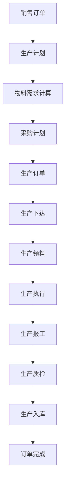
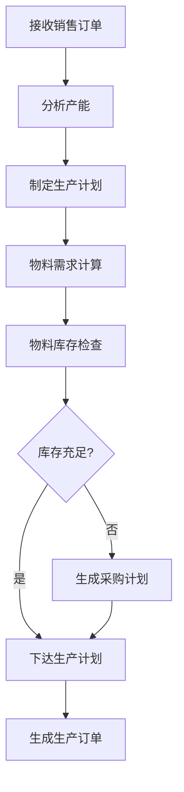
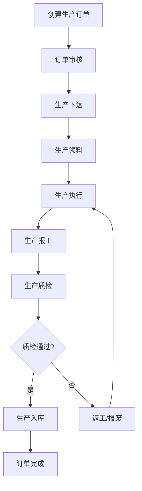

# QooERP 生产管理模块 - 业务设计文档

> 模块名称: qooerp-production  
> 模块版本: v1.0  
> 创建日期: 20xx-xx-xx  
> 作者: Auto  

---

## 一、业务概述

### 1.1 业务定位

生产管理模块是QooERP的核心业务模块之一,负责企业生产全流程管理,包括生产计划、生产订单、生产领料、生产入库等环节。

### 1.2 业务目标

- 提升生产计划准确率
- 优化生产资源配置
- 降低生产成本
- 提高生产效率
- 确保生产质量

### 1.3 业务价值

- **计划管控**: 精准的生产计划和物料需求计划
- **流程优化**: 标准化生产流程,提高生产效率
- **成本控制**: 实时监控生产成本,优化资源配置
- **质量保障**: 生产过程质量控制,确保产品质量

---

## 二、核心功能

### 2.1 生产计划管理

#### 2.1.1 功能描述

根据销售订单和库存情况,制定生产计划和物料需求计划。

#### 2.1.2 业务流程

```
销售订单 → 生产计划 → 物料需求 → 采购计划 → 生产执行
```

#### 2.1.3 核心功能点

- 生产计划创建
- 物料需求计算(MRP)
- 生产计划审核
- 生产计划下达
- 生产计划调整

### 2.2 生产订单管理

#### 2.2.1 功能描述

根据生产计划生成生产订单,跟踪生产进度。

#### 2.2.2 业务流程

```
生产计划 → 生产订单 → 生产下达 → 生产执行 → 生产完成
```

#### 2.2.3 核心功能点

- 生产订单创建
- 生产订单审核
- 生产下达
- 生产进度跟踪
- 生产订单完成
- 生产订单关闭

### 2.3 生产领料管理

#### 2.3.1 功能描述

根据生产订单进行物料领用,管理领料过程。

#### 2.3.2 业务流程

```
生产订单 → 领料单 → 领料审核 → 库存扣减 → 生产使用
```

#### 2.3.3 核心功能点

- 领料单创建
- 领料单审核
- 领料出库
- 领料退回
- 领料统计

### 2.4 生产入库管理

#### 2.4.1 功能描述

生产完成后,将成品入库,更新库存。

#### 2.4.2 业务流程

```
生产完成 → 入库单 → 质检 → 入库审核 → 库存增加
```

#### 2.4.3 核心功能点

- 入库单创建
- 质检管理
- 入库审核
- 库存增加
- 入库统计

### 2.5 生产报工管理

#### 2.5.1 功能描述

记录生产过程中的工时、产量等数据。

#### 2.5.2 核心功能点

- 生产报工
- 工时统计
- 产量统计
- 异常记录

### 2.6 生产质量管理

#### 2.6.1 功能描述

生产过程中的质量管理和质检流程。

#### 2.6.2 核心功能点

- 质检标准管理
- 质检任务创建
- 质检结果记录
- 不良品处理
- 质量统计分析

---

## 三、业务流程设计

### 3.1 主业务流程



### 3.2 生产计划流程



### 3.3 生产订单流程



---

## 四、领域模型设计

### 4.1 领域实体

| 实体名称 | 说明 | 核心属性 |
|---------|------|---------|
| ProductionPlan | 生产计划 | 计划编号、计划名称、计划日期、计划数量、状态 |
| ProductionOrder | 生产订单 | 订单编号、计划编号、产品编号、订单数量、状态 |
| ProductionMaterial | 生产物料 | 物料编号、订单编号、物料数量、领料状态 |
| ProductionReceipt | 生产入库单 | 入库编号、订单编号、入库数量、质检状态 |
| ProductionReport | 生产报工 | 报工编号、订单编号、工时、产量 |
| ProductionQuality | 生产质检 | 质检编号、订单编号、质检结果、质检人 |

### 4.2 实体关系

```
ProductionPlan (1) ---- (N) ProductionOrder
ProductionOrder (1) ---- (N) ProductionMaterial
ProductionOrder (1) ---- (N) ProductionReceipt
ProductionOrder (1) ---- (N) ProductionReport
ProductionReceipt (1) ---- (N) ProductionQuality
```

---

## 五、业务规则

### 5.1 生产计划规则

- 生产计划需要根据销售订单和库存情况制定
- 物料需求计划需要考虑安全库存
- 生产计划需要经过审核才能下达
- 计划可以调整,但需要记录变更历史

### 5.2 生产订单规则

- 生产订单必须关联生产计划
- 生产订单审核后才能下达生产
- 生产订单完成后才能关闭
- 关闭后的订单不能再次操作

### 5.3 领料规则

- 领料必须基于生产订单
- 领料数量不能超过订单需求
- 领料需要经过审核
- 领料后需要扣减库存

### 5.4 入库规则

- 入库必须基于生产订单
- 入库数量不能超过订单数量
- 入库前必须经过质检
- 入库后增加库存

---

## 六、接口需求

### 6.1 内部接口

| 接口名称 | 说明 | 调用方 |
|---------|------|--------|
| getInventory | 获取物料库存 | ProductionModule |
| updateInventory | 更新库存 | ProductionModule |
| getSalesOrder | 获取销售订单 | ProductionModule |
| createPurchaseOrder | 创建采购订单 | ProductionModule |

### 6.2 外部接口

| 接口名称 | 说明 | 调用方 |
|---------|------|--------|
| createProductionPlan | 创建生产计划 | 外部系统 |
| getProductionOrder | 获取生产订单 | 外部系统 |
| submitProductionReport | 提交生产报工 | 外部系统 |

---

## 七、数据统计需求

### 7.1 生产统计

- 生产计划完成率
- 生产订单完成率
- 生产效率统计
- 生产成本统计

### 7.2 物料统计

- 物料消耗统计
- 物料利用率
- 领料统计

### 7.3 质量统计

- 质检合格率
- 不良品率
- 返工率

---

## 八、非功能性需求

### 8.1 性能需求

- 支持生产订单数: 100,000+
- 响应时间: < 1s
- 并发用户: 100+

### 8.2 安全需求

- 数据权限控制
- 操作日志记录
- 敏感数据加密

### 8.3 可用性需求

- 系统可用性: 99.9%
- 数据备份: 每日备份

---

## 九、附录

### 9.1 业务术语

| 术语 | 说明 |
|------|------|
| 生产计划 | 根据销售订单制定的生产安排 |
| 生产订单 | 具体的生产任务单据 |
| 物料需求 | 生产所需的物料清单 |
| 领料 | 从仓库领取生产物料 |
| 入库 | 生产完成后将成品入库 |
| 质检 | 对生产产品进行质量检查 |

### 9.2 参考文档

- [QooERP总体架构设计](../../01-docs/04-总体架构清单.md)
- [QooERP微服务模块清单](../../01-docs/03-微服务模块清单.md)

---

**文档版本**: v1.0  
**最后更新**: 20xx-xx-xx
