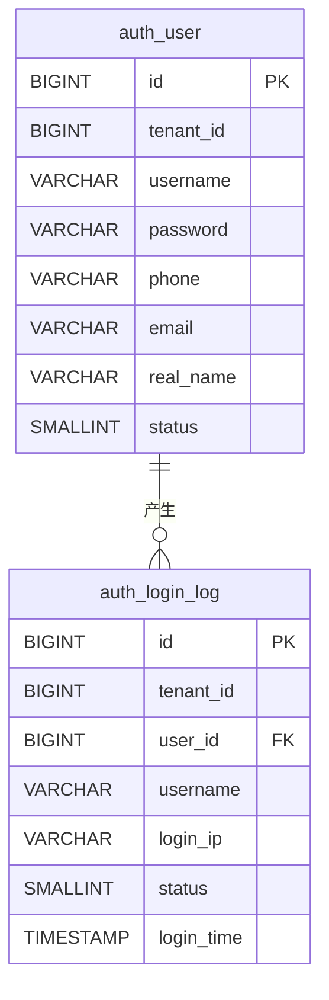

# qooerp-auth 认证服务 - 数据设计文档

> 模块版本：1.0.0-SNAPSHOT
> 创建日期：2026-02-17
> 文档作者：QooERP团队

---

## 一、数据库概述

### 1.1 数据库信息

| 项目 | 值 |
|------|-----|
| 数据库名称 | qooerp_auth |
| 数据库类型 | PostgreSQL 15+ |
| 字符集 | UTF8 |
| 排序规则 | zh_CN.UTF-8 |

### 1.2 表清单

| 序号 | 表名 | 中文名 | 说明 |
|------|------|--------|------|
| 1 | sys_user | 用户表 | 存储用户基本信息 |
| 2 | sys_login_log | 登录日志表 | 存储用户登录记录 |
| 3 | sys_user_role | 用户角色关联表 | 用户与角色多对多关系（待建） |
| 4 | sys_user_organization | 用户组织关联表 | 用户与组织多对多关系（待建） |

---

## 二、数据表设计

### 2.1 auth_user 用户表

#### 2.1.1 表结构

| 序号 | 字段名 | 类型 | 长度 | 允许NULL | 默认值 | 主键 | 说明 |
|------|--------|------|------|----------|--------|------|------|
| 1 | user_id | BIGINT | 20 | NO | | YES | 用户ID（雪花算法） |
| 2 | tenant_id | BIGINT | 20 | YES | 0 | NO | 租户ID |
| 3 | username | VARCHAR | 50 | NO | | NO | 用户名（唯一） |
| 4 | password | VARCHAR | 255 | NO | | NO | 密码（BCrypt加密） |
| 5 | phone | VARCHAR | 20 | YES | | NO | 手机号 |
| 6 | email | VARCHAR | 100 | YES | | NO | 邮箱 |
| 7 | real_name | VARCHAR | 50 | YES | | NO | 真实姓名 |
| 8 | nickname | VARCHAR | 50 | YES | | NO | 昵称 |
| 9 | avatar | VARCHAR | 500 | YES | | NO | 头像URL |
| 10 | gender | TINYINT | 1 | YES | 0 | NO | 性别：0-未知 1-男 2-女 |
| 11 | birthday | DATE | | YES | | NO | 生日 |
| 12 | status | TINYINT | 1 | NO | 1 | NO | 状态：0-禁用 1-启用 |
| 13 | lock_time | TIMESTAMP | | YES | | NO | 锁定时间 |
| 14 | failed_count | INT | 11 | NO | 0 | NO | 登录失败次数 |
| 15 | last_login_time | TIMESTAMP | | YES | | NO | 最后登录时间 |
| 16 | last_login_ip | VARCHAR | 50 | YES | | NO | 最后登录IP |
| 17 | create_time | TIMESTAMP | | NO | CURRENT_TIMESTAMP | NO | 创建时间 |
| 18 | create_by | VARCHAR | 50 | YES | | NO | 创建人 |
| 19 | update_time | TIMESTAMP | | NO | CURRENT_TIMESTAMP | NO | 更新时间 |
| 20 | update_by | VARCHAR | 50 | YES | | NO | 更新人 |
| 21 | deleted | TINYINT | 1 | NO | 0 | NO | 删除标记：0-未删除 1-已删除 |

#### 2.1.2 索引设计

| 索引名 | 索引类型 | 索引字段 | 说明 |
|--------|---------|---------|------|
| PRIMARY | 主键索引 | user_id | 主键索引 |
| uk_username | 唯一索引 | username | 用户名唯一 |
| idx_phone | 普通索引 | phone, deleted | 手机号索引 |
| idx_email | 普通索引 | email, deleted | 邮箱索引 |
| idx_tenant_id | 普通索引 | tenant_id, deleted | 租户索引 |
| idx_create_time | 普通索引 | create_time | 创建时间索引 |

#### 2.1.3 建表SQL

```sql
CREATE TABLE auth_user (
    id BIGSERIAL PRIMARY KEY,
    tenant_id BIGINT NOT NULL DEFAULT 0,
    username VARCHAR(50) NOT NULL,
    password VARCHAR(255) NOT NULL,
    phone VARCHAR(20),
    email VARCHAR(100),
    real_name VARCHAR(50),
    nickname VARCHAR(50),
    avatar VARCHAR(500),
    gender SMALLINT DEFAULT 0,
    birthday DATE,
    status SMALLINT NOT NULL DEFAULT 1,
    lock_time TIMESTAMP,
    failed_count INTEGER NOT NULL DEFAULT 0,
    last_login_time TIMESTAMP,
    last_login_ip VARCHAR(50),
    create_time TIMESTAMP NOT NULL DEFAULT CURRENT_TIMESTAMP,
    create_by VARCHAR(50),
    update_time TIMESTAMP NOT NULL DEFAULT CURRENT_TIMESTAMP,
    update_by VARCHAR(50),
    deleted SMALLINT NOT NULL DEFAULT 0
);

-- 创建索引
CREATE UNIQUE INDEX uk_auth_username ON auth_user(username);
CREATE INDEX idx_auth_phone ON auth_user(phone, deleted);
CREATE INDEX idx_auth_email ON auth_user(email, deleted);
CREATE INDEX idx_auth_tenant_id ON auth_user(tenant_id, deleted);
CREATE INDEX idx_auth_create_time ON auth_user(create_time);

-- 添加表注释
COMMENT ON TABLE auth_user IS '用户表';
COMMENT ON COLUMN auth_user.id IS '用户ID';
COMMENT ON COLUMN auth_user.tenant_id IS '租户ID';
COMMENT ON COLUMN auth_user.username IS '用户名';
COMMENT ON COLUMN auth_user.password IS '密码（BCrypt加密）';
COMMENT ON COLUMN auth_user.phone IS '手机号';
COMMENT ON COLUMN auth_user.email IS '邮箱';
COMMENT ON COLUMN auth_user.real_name IS '真实姓名';
COMMENT ON COLUMN auth_user.nickname IS '昵称';
COMMENT ON COLUMN auth_user.avatar IS '头像URL';
COMMENT ON COLUMN auth_user.gender IS '性别：0-未知 1-男 2-女';
COMMENT ON COLUMN auth_user.birthday IS '生日';
COMMENT ON COLUMN auth_user.status IS '状态：0-禁用 1-启用';
COMMENT ON COLUMN auth_user.lock_time IS '锁定时间';
COMMENT ON COLUMN auth_user.failed_count IS '登录失败次数';
COMMENT ON COLUMN auth_user.last_login_time IS '最后登录时间';
COMMENT ON COLUMN auth_user.last_login_ip IS '最后登录IP';
```

---

### 2.2 auth_login_log 登录日志表

#### 2.2.1 表结构

| 序号 | 字段名 | 类型 | 长度 | 允许NULL | 默认值 | 主键 | 说明 |
|------|--------|------|------|----------|--------|------|------|
| 1 | log_id | BIGINT | 20 | NO | | YES | 日志ID（雪花算法） |
| 2 | tenant_id | BIGINT | 20 | YES | 0 | NO | 租户ID |
| 3 | user_id | BIGINT | 20 | YES | | NO | 用户ID |
| 4 | username | VARCHAR | 50 | YES | | NO | 用户名 |
| 5 | login_ip | VARCHAR | 50 | YES | | NO | 登录IP |
| 6 | login_location | VARCHAR | 100 | YES | | NO | 登录地点 |
| 7 | browser | VARCHAR | 50 | YES | | NO | 浏览器类型 |
| 8 | os | VARCHAR | 50 | YES | | NO | 操作系统 |
| 9 | device | VARCHAR | 50 | YES | | NO | 设备类型 |
| 10 | status | TINYINT | 1 | NO | 0 | NO | 登录状态：0-失败 1-成功 |
| 11 | message | VARCHAR | 500 | YES | | NO | 登录消息 |
| 12 | login_time | TIMESTAMP | | NO | CURRENT_TIMESTAMP | NO | 登录时间 |
| 13 | create_time | TIMESTAMP | | NO | CURRENT_TIMESTAMP | NO | 创建时间 |

#### 2.2.2 索引设计

| 索引名 | 索引类型 | 索引字段 | 说明 |
|--------|---------|---------|------|
| PRIMARY | 主键索引 | log_id | 主键索引 |
| idx_user_id | 普通索引 | user_id, login_time | 用户ID索引 |
| idx_tenant_id | 普通索引 | tenant_id, login_time | 租户索引 |
| idx_login_time | 普通索引 | login_time | 登录时间索引 |
| idx_status | 普通索引 | status, login_time | 状态索引 |
| idx_login_ip | 普通索引 | login_ip, login_time | 登录IP索引 |

#### 2.2.3 建表SQL

```sql
CREATE TABLE auth_login_log (
    id BIGSERIAL PRIMARY KEY,
    tenant_id BIGINT NOT NULL DEFAULT 0,
    user_id BIGINT,
    username VARCHAR(50),
    login_ip VARCHAR(50),
    login_location VARCHAR(100),
    browser VARCHAR(50),
    os VARCHAR(50),
    device VARCHAR(50),
    status SMALLINT NOT NULL DEFAULT 0,
    message VARCHAR(500),
    login_time TIMESTAMP NOT NULL DEFAULT CURRENT_TIMESTAMP,
    create_time TIMESTAMP NOT NULL DEFAULT CURRENT_TIMESTAMP
);

-- 创建索引
CREATE INDEX idx_auth_user_id ON auth_login_log(user_id, login_time);
CREATE INDEX idx_auth_tenant_id ON auth_login_log(tenant_id, login_time);
CREATE INDEX idx_auth_login_time ON auth_login_log(login_time);
CREATE INDEX idx_auth_status ON auth_login_log(status, login_time);
CREATE INDEX idx_auth_login_ip ON auth_login_log(login_ip, login_time);

-- 添加表注释
COMMENT ON TABLE auth_login_log IS '登录日志表';
COMMENT ON COLUMN auth_login_log.id IS '日志ID';
COMMENT ON COLUMN auth_login_log.tenant_id IS '租户ID';
COMMENT ON COLUMN auth_login_log.user_id IS '用户ID';
COMMENT ON COLUMN auth_login_log.username IS '用户名';
COMMENT ON COLUMN auth_login_log.login_ip IS '登录IP';
COMMENT ON COLUMN auth_login_log.login_location IS '登录地点';
COMMENT ON COLUMN auth_login_log.browser IS '浏览器类型';
COMMENT ON COLUMN auth_login_log.os IS '操作系统';
COMMENT ON COLUMN auth_login_log.device IS '设备类型';
COMMENT ON COLUMN auth_login_log.status IS '登录状态：0-失败 1-成功';
COMMENT ON COLUMN auth_login_log.message IS '登录消息';
COMMENT ON COLUMN auth_login_log.login_time IS '登录时间';
```

---

## 三、数据字典

### 3.1 auth_user 字段枚举

#### status（用户状态）

| 值 | 名称 | 说明 |
|----|------|------|
| 0 | 禁用 | 用户被禁用，无法登录 |
| 1 | 启用 | 用户正常，可以登录 |

#### gender（性别）

| 值 | 名称 | 说明 |
|----|------|------|
| 0 | 未知 | 未设置性别 |
| 1 | 男 | 男性 |
| 2 | 女 | 女性 |

### 3.2 auth_login_log 字段枚举

#### status（登录状态）

| 值 | 名称 | 说明 |
|----|------|------|
| 0 | 失败 | 登录失败 |
| 1 | 成功 | 登录成功 |

#### device（设备类型）

| 值 | 名称 | 说明 |
|----|------|------|
| PC | PC端 | 电脑浏览器 |
| MOBILE | 移动端 | 手机浏览器 |
| TABLET | 平板端 | 平板浏览器 |
| APP | APP端 | 移动应用 |

---

## 四、初始化数据

### 4.1 默认管理员账号

```sql
-- 插入默认管理员
INSERT INTO auth_user (
    tenant_id, username, password, real_name, status, create_by, update_by
) VALUES (
    0,
    'admin',
    '$2a$10$N.zmdr9k7uOCQb376NoUnuTJ8iAt6Z5EHsM8lE9lBOsl7iKTVKIUi',
    '系统管理员',
    1,
    'system',
    'system'
);

-- 注：默认密码为 admin123，BCrypt加密后的值
```

### 4.2 初始化SQL脚本

详见：[04-数据库脚本.sql](./04-数据库脚本.sql)

---

## 五、数据关系

### 5.1 ER图



### 5.2 关系说明

| 表A | 表B | 关系类型 | 说明 |
|-----|-----|---------|------|
| sys_user | sys_login_log | 1:N | 一个用户可以有多条登录日志 |

---

## 六、数据维护

### 6.1 数据清理策略

| 表名 | 清理策略 | 保留周期 |
|------|---------|---------|
| sys_login_log | 定期清理 | 保留90天 |
| sys_user | 软删除 | 永久保留 |

### 6.2 数据备份策略

| 备份类型 | 频率 | 保留周期 |
|---------|------|---------|
| 全量备份 | 每天凌晨2点 | 保留7天 |
| 增量备份 | 每小时 | 保留24小时 |

### 6.3 数据归档

- 登录日志超过90天的数据归档到历史表 `auth_login_log_history`
- 已删除用户数据（deleted=1）超过1年归档到 `auth_user_history`

---

## 七、数据安全

### 7.1 敏感字段加密

| 字段名 | 加密方式 | 说明 |
|--------|---------|------|
| password | BCrypt | 单向加密，不可解密 |
| phone | AES | 可逆加密 |
| email | AES | 可逆加密 |

### 7.2 数据脱敏

| 字段名 | 脱敏规则 | 示例 |
|--------|---------|------|
| phone | 中间4位脱敏 | 138****1234 |
| email | 邮箱前2位脱敏 | ab****@example.com |
| id_card | 中间8位脱敏 | 110***********123 |

### 7.3 数据权限

| 操作 | 权限要求 |
|------|---------|
| 查询用户 | 需要用户查看权限 |
| 修改用户 | 需要用户编辑权限 |
| 删除用户 | 需要用户删除权限 |
| 查看登录日志 | 需要日志查看权限 |

---

## 八、性能优化

### 8.1 索引优化

- 已为常用查询字段创建索引
- 复合索引遵循最左前缀原则
- 定期分析索引使用情况

### 8.2 查询优化

- 使用分页查询，避免全表扫描
- 使用覆盖索引，减少回表
- 避免使用 `SELECT *`

### 8.3 分区策略

`auth_login_log` 表按月分区：

```sql
-- 创建分区表
CREATE TABLE auth_login_log (
    -- 表结构
) PARTITION BY RANGE (login_time);

-- 创建月度分区
CREATE TABLE auth_login_log_202602 PARTITION OF auth_login_log
    FOR VALUES FROM ('2026-02-01') TO ('2026-03-01');
```

---

## 九、参考资料

- [PostgreSQL官方文档](https://www.postgresql.org/docs/)
- [数据库设计规范](https://docs.qooerp.com/database-design)
