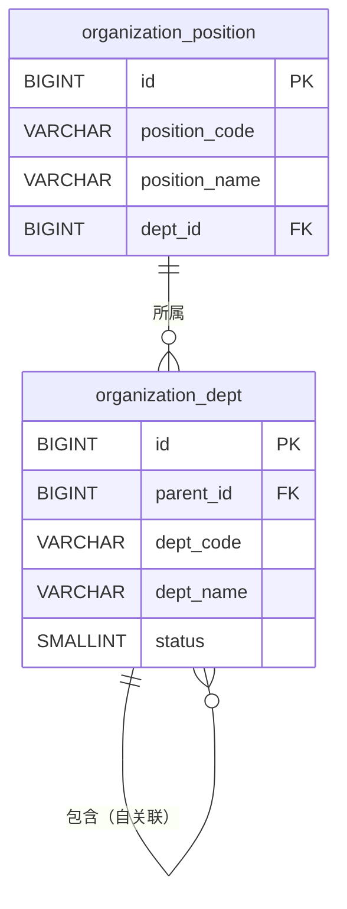

# qooerp-organization 组织管理 - 数据设计文档

> 模块版本：1.0.0-SNAPSHOT
> 创建日期：2026-02-17
> 文档作者：QooERP团队

---

## 一、数据库概述

### 1.1 数据库信息

| 项目 | 值 |
|------|-----|
| 数据库名称 | qooerp_organization |
| 数据库类型 | PostgreSQL 15+ |
| 字符集 | UTF8 |
| 排序规则 | zh_CN.UTF-8 |

### 1.2 表清单

| 序号 | 表名 | 中文名 | 说明 |
|------|------|--------|------|
| 1 | organization_dept | 部门表 | 存储部门信息 |
| 2 | organization_position | 岗位表 | 存储岗位信息 |

---

## 二、数据表设计

### 2.1 organization_dept 部门表

#### 2.1.1 表结构

| 序号 | 字段名 | 类型 | 长度 | 允许NULL | 默认值 | 主键 | 说明 |
|------|--------|------|------|----------|--------|------|------|
| 1 | id | BIGINT | 20 | NO | | YES | 部门ID |
| 2 | tenant_id | BIGINT | 20 | YES | 0 | NO | 租户ID |
| 3 | parent_id | BIGINT | 20 | YES | 0 | NO | 父部门ID |
| 4 | dept_name | VARCHAR | 100 | NO | | NO | 部门名称 |
| 5 | dept_code | VARCHAR | 50 | NO | | NO | 部门编码（唯一） |
| 6 | leader_id | BIGINT | 20 | YES | | NO | 负责人ID |
| 7 | phone | VARCHAR | 20 | YES | | NO | 联系电话 |
| 8 | email | VARCHAR | 100 | YES | | NO | 邮箱 |
| 9 | address | VARCHAR | 200 | YES | | NO | 地址 |
| 10 | sort | INT | 11 | YES | 0 | NO | 排序号 |
| 11 | status | TINYINT | 1 | NO | 1 | NO | 状态：0-禁用 1-启用 |
| 12 | remark | VARCHAR | 500 | YES | | NO | 备注 |
| 13 | create_time | TIMESTAMP | | NO | CURRENT_TIMESTAMP | NO | 创建时间 |
| 14 | create_by | VARCHAR | 50 | YES | | NO | 创建人 |
| 15 | update_time | TIMESTAMP | | NO | CURRENT_TIMESTAMP | NO | 更新时间 |
| 16 | update_by | VARCHAR | 50 | YES | | NO | 更新人 |

#### 2.1.2 建表SQL

```sql
CREATE TABLE organization_dept (
    id BIGSERIAL PRIMARY KEY,
    tenant_id BIGINT NOT NULL DEFAULT 0,
    parent_id BIGINT DEFAULT 0,
    dept_name VARCHAR(100) NOT NULL,
    dept_code VARCHAR(50) NOT NULL,
    leader_id BIGINT,
    phone VARCHAR(20),
    email VARCHAR(100),
    address VARCHAR(200),
    sort INTEGER DEFAULT 0,
    status SMALLINT NOT NULL DEFAULT 1,
    remark VARCHAR(500),
    create_time TIMESTAMP NOT NULL DEFAULT CURRENT_TIMESTAMP,
    create_by VARCHAR(50),
    update_time TIMESTAMP NOT NULL DEFAULT CURRENT_TIMESTAMP,
    update_by VARCHAR(50)
);

CREATE UNIQUE INDEX uk_organization_dept_code ON organization_dept(dept_code);
CREATE INDEX idx_organization_parent_id ON organization_dept(parent_id);
COMMENT ON TABLE organization_dept IS '部门表';
```

---

### 2.2 organization_position 岗位表

#### 2.2.1 表结构

| 序号 | 字段名 | 类型 | 长度 | 允许NULL | 默认值 | 主键 | 说明 |
|------|--------|------|------|----------|--------|------|------|
| 1 | id | BIGINT | 20 | NO | | YES | 岗位ID |
| 2 | tenant_id | BIGINT | 20 | YES | 0 | NO | 租户ID |
| 3 | position_name | VARCHAR | 100 | NO | | NO | 岗位名称 |
| 4 | position_code | VARCHAR | 50 | NO | | NO | 岗位编码（唯一） |
| 5 | position_level | INT | 11 | YES | 0 | NO | 岗位级别 |
| 6 | dept_id | BIGINT | 20 | YES | | NO | 所属部门ID |
| 7 | status | TINYINT | 1 | NO | 1 | NO | 状态：0-禁用 1-启用 |
| 8 | remark | VARCHAR | 500 | YES | | NO | 备注 |
| 9 | create_time | TIMESTAMP | | NO | CURRENT_TIMESTAMP | NO | 创建时间 |
| 10 | create_by | VARCHAR | 50 | YES | | NO | 创建人 |
| 11 | update_time | TIMESTAMP | | NO | CURRENT_TIMESTAMP | NO | 更新时间 |
| 12 | update_by | VARCHAR | 50 | YES | | NO | 更新人 |

#### 2.2.2 建表SQL

```sql
CREATE TABLE organization_position (
    id BIGSERIAL PRIMARY KEY,
    tenant_id BIGINT NOT NULL DEFAULT 0,
    position_name VARCHAR(100) NOT NULL,
    position_code VARCHAR(50) NOT NULL,
    position_level INTEGER DEFAULT 0,
    dept_id BIGINT,
    status SMALLINT NOT NULL DEFAULT 1,
    remark VARCHAR(500),
    create_time TIMESTAMP NOT NULL DEFAULT CURRENT_TIMESTAMP,
    create_by VARCHAR(50),
    update_time TIMESTAMP NOT NULL DEFAULT CURRENT_TIMESTAMP,
    update_by VARCHAR(50)
);

CREATE UNIQUE INDEX uk_organization_position_code ON organization_position(position_code);
CREATE INDEX idx_organization_dept_id ON organization_position(dept_id);
COMMENT ON TABLE organization_position IS '岗位表';
```

---

## 三、初始化数据

```sql
-- 插入默认部门
INSERT INTO organization_dept (dept_name, dept_code, parent_id, sort, create_by) VALUES
('总公司', 'HEADQUARTERS', 0, 1, 'system'),
('研发部', 'RD', 1, 1, 'system'),
('市场部', 'MARKETING', 1, 2, 'system'),
('销售部', 'SALES', 1, 3, 'system');

-- 插入默认岗位
INSERT INTO organization_position (position_name, position_code, position_level, create_by) VALUES
('总经理', 'CEO', 1, 'system'),
('技术总监', 'CTO', 2, 'system'),
('市场总监', 'CMO', 2, 'system'),
('销售总监', 'CSO', 2, 'system'),
('研发经理', 'RDM', 3, 'system'),
('销售经理', 'SM', 3, 'system');
```

---

## 四、数据关系



---

## 五、参考资料

- [PostgreSQL官方文档](https://www.postgresql.org/docs/)
