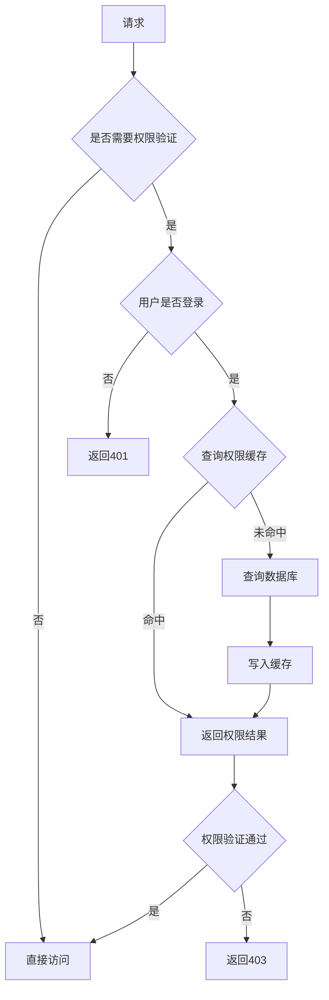

# qooerp-permission 权限服务 - 应用设计文档

> 模块版本：1.0.0-SNAPSHOT
> 创建日期：2026-02-17
> 文档作者：QooERP团队

---

## 一、架构概述

### 1.1 技术栈

| 技术 | 版本 | 用途 |
|------|------|------|
| Spring Boot | 3.2.x | 应用框架 |
| Spring Security | 6.2.x | 安全框架 |
| MyBatis-Plus | 3.5.x | ORM框架 |
| Redis | 7.x | 缓存 |
| PostgreSQL | 15.x | 数据库 |
| JWT | - | 令牌认证 |

### 1.2 分层架构

```
┌─────────────────────────────────────────┐
│         API网关层                    │
│    (路由、限流、认证)                │
└─────────────────────────────────────────┘
                ↓
┌─────────────────────────────────────────┐
│         Controller层                   │
│    (接收请求、参数校验)               │
└─────────────────────────────────────────┘
                ↓
┌─────────────────────────────────────────┐
│         Service层                     │
│    (业务逻辑、事务控制)                │
└─────────────────────────────────────────┘
                ↓
┌─────────────────────────────────────────┐
│         Mapper层                       │
│    (数据访问、SQL执行)                │
└─────────────────────────────────────────┘
                ↓
┌─────────────────────────────────────────┐
│         数据层                        │
│    (PostgreSQL/Redis)                     │
└─────────────────────────────────────────┘
```

---

## 二、包结构设计

### 2.1 标准包结构

```
com.qoobot.qooerp.permission/
├── controller/              # 控制器层
│   ├── PermissionRoleController.java
│   ├── PermissionMenuController.java
│   └── PermissionController.java
├── service/                 # 服务层
│   ├── PermissionRoleService.java
│   ├── PermissionMenuService.java
│   ├── PermissionUserService.java
│   ├── PermissionService.java
│   └── impl/             # 服务实现
│       ├── PermissionRoleServiceImpl.java
│       ├── PermissionMenuServiceImpl.java
│       ├── PermissionUserServiceImpl.java
│       └── PermissionServiceImpl.java
├── mapper/                  # 数据访问层
│   ├── PermissionRoleMapper.java
│   ├── PermissionMenuMapper.java
│   ├── PermissionRoleMenuMapper.java
│   └── PermissionUserRoleMapper.java
├── entity/                  # 实体类
│   ├── PermissionRole.java
│   ├── PermissionMenu.java
│   ├── PermissionRoleMenu.java
│   └── PermissionUserRole.java
├── dto/                     # 数据传输对象
│   ├── PermissionRoleRequest.java
│   ├── PermissionRoleResponse.java
│   ├── PermissionMenuRequest.java
│   └── PermissionMenuResponse.java
├── vo/                      # 视图对象
│   ├── PermissionRoleVO.java
│   ├── PermissionMenuVO.java
│   └── PermissionTreeVO.java
├── config/                  # 配置类
│   ├── RedisConfig.java
│   └── SecurityConfig.java
├── enums/                   # 枚举类
│   ├── RoleTypeEnum.java
│   ├── MenuTypeEnum.java
│   └── DataScopeEnum.java
├── constants/               # 常量类
│   └── PermissionConstants.java
└── util/                    # 工具类
    └── PermissionUtil.java
```

---

## 三、核心类设计

### 3.1 实体类

#### 3.1.1 PermissionRole（角色实体）

```java
package com.qoobot.qooerp.permission.entity;

import com.baomidou.mybatisplus.annotation.*;
import entity.com.qoobot.qooerp.common.BaseEntity;
import lombok.Data;
import lombok.EqualsAndHashCode;

@Data
@EqualsAndHashCode(callSuper = true)
@TableName("permission_role")
public class PermissionRole extends BaseEntity {

    @TableId(type = IdType.AUTO)
    private Long id;

    /**
     * 角色名称
     */
    private String roleName;

    /**
     * 角色编码
     */
    private String roleCode;

    /**
     * 角色类型：1-系统角色 2-业务角色
     */
    private Integer roleType;

    /**
     * 数据权限范围：1-全部 2-部门 3-部门及子部门 4-本人 5-自定义
     */
    private Integer dataScope;

    /**
     * 自定义部门ID（dataScope=5时使用）
     */
    private String deptIds;

    /**
     * 状态：0-禁用 1-启用
     */
    private Integer status;

    /**
     * 排序号
     */
    private Integer sort;

    /**
     * 备注
     */
    private String remark;
}
```

#### 3.1.2 PermissionMenu（菜单实体）

```java
package com.qoobot.qooerp.permission.entity;

import com.baomidou.mybatisplus.annotation.*;
import entity.com.qoobot.qooerp.common.BaseEntity;
import lombok.Data;
import lombok.EqualsAndHashCode;

@Data
@EqualsAndHashCode(callSuper = true)
@TableName("permission_menu")
public class PermissionMenu extends BaseEntity {

    @TableId(type = IdType.AUTO)
    private Long id;

    /**
     * 父菜单ID
     */
    private Long parentId;

    /**
     * 菜单名称
     */
    private String menuName;

    /**
     * 菜单类型：M-目录 C-菜单 F-按钮
     */
    private String menuType;

    /**
     * 路由路径
     */
    private String path;

    /**
     * 组件路径
     */
    private String component;

    /**
     * 权限标识
     */
    private String permission;

    /**
     * 图标
     */
    private String icon;

    /**
     * 排序号
     */
    private Integer sort;

    /**
     * 是否显示：0-隐藏 1-显示
     */
    private Integer visible;

    /**
     * 是否缓存：0-不缓存 1-缓存
     */
    private Integer isCache;

    /**
     * 路由外链
     */
    private String isFrame;

    /**
     * 备注
     */
    private String remark;
}
```

#### 3.1.3 PermissionRoleMenu（角色菜单关联实体）

```java
package com.qoobot.qooerp.permission.entity;

import com.baomidou.mybatisplus.annotation.IdType;
import com.baomidou.mybatisplus.annotation.TableField;
import com.baomidou.mybatisplus.annotation.TableId;
import com.baomidou.mybatisplus.annotation.TableName;
import lombok.Data;

@Data
@TableName("permission_role_menu")
public class PermissionRoleMenu {

    @TableId(type = IdType.AUTO)
    private Long id;

    /**
     * 角色ID
     */
    private Long roleId;

    /**
     * 菜单ID
     */
    private Long menuId;
}
```

#### 3.1.4 PermissionUserRole（用户角色关联实体）

```java
package com.qoobot.qooerp.permission.entity;

import com.baomidou.mybatisplus.annotation.IdType;
import com.baomidou.mybatisplus.annotation.TableId;
import com.baomidou.mybatisplus.annotation.TableName;
import lombok.Data;

@Data
@TableName("permission_user_role")
public class PermissionUserRole {

    @TableId(type = IdType.AUTO)
    private Long id;

    /**
     * 用户ID
     */
    private Long userId;

    /**
     * 角色ID
     */
    private Long roleId;
}
```

### 3.2 Service接口设计

#### 3.2.1 PermissionRoleService

```java
package com.qoobot.qooerp.permission.service;

import com.baomidou.mybatisplus.extension.service.IService;
import com.qoobot.qooerp.permission.dto.PermissionRoleRequest;
import com.qoobot.qooerp.permission.dto.PermissionRoleResponse;
import com.qoobot.qooerp.permission.entity.PermissionRole;
import java.util.List;

public interface PermissionRoleService extends IService<PermissionRole> {

    /**
     * 创建角色
     */
    Long createRole(PermissionRoleRequest request);

    /**
     * 更新角色
     */
    void updateRole(Long id, PermissionRoleRequest request);

    /**
     * 删除角色
     */
    void deleteRole(Long id);

    /**
     * 分页查询角色
     */
    IPage<PermissionRoleResponse> pageRoles(IPage<?> page, PermissionRoleRequest request);

    /**
     * 分配菜单权限
     */
    void assignMenus(Long roleId, List<Long> menuIds);

    /**
     * 查询角色的菜单ID列表
     */
    List<Long> getMenuIdsByRoleId(Long roleId);

    /**
     * 查询用户的角色列表
     */
    List<PermissionRole> getRolesByUserId(Long userId);
}
```

#### 3.2.2 PermissionMenuService

```java
package com.qoobot.qooerp.permission.service;

import com.baomidou.mybatisplus.extension.service.IService;
import com.qoobot.qooerp.permission.dto.PermissionMenuRequest;
import com.qoobot.qooerp.permission.dto.PermissionMenuResponse;
import com.qoobot.qooerp.permission.dto.PermissionTreeVO;
import com.qoobot.qooerp.permission.entity.PermissionMenu;
import java.util.List;

public interface PermissionMenuService extends IService<PermissionMenu> {

    /**
     * 创建菜单
     */
    Long createMenu(PermissionMenuRequest request);

    /**
     * 更新菜单
     */
    void updateMenu(Long id, PermissionMenuRequest request);

    /**
     * 删除菜单
     */
    void deleteMenu(Long id);

    /**
     * 查询菜单树
     */
    List<PermissionTreeVO> getMenuTree();

    /**
     * 查询用户的菜单树
     */
    List<PermissionTreeVO> getUserMenuTree(Long userId);

    /**
     * 查询用户的权限标识列表
     */
    List<String> getUserPermissions(Long userId);
}
```

#### 3.2.3 PermissionUserService

```java
package com.qoobot.qooerp.permission.service;

import com.qoobot.qooerp.permission.entity.PermissionRole;
import java.util.List;

public interface PermissionUserService {

    /**
     * 为用户分配角色
     */
    void assignRoles(Long userId, List<Long> roleIds);

    /**
     * 查询用户的角色列表
     */
    List<PermissionRole> getUserRoles(Long userId);

    /**
     * 移除用户角色
     */
    void removeUserRoles(Long userId);
}
```

#### 3.2.4 PermissionService（权限验证核心）

```java
package com.qoobot.qooerp.permission.service;

import java.util.Set;

public interface PermissionService {

    /**
     * 验证用户是否有指定权限
     */
    boolean hasPermission(Long userId, String permission);

    /**
     * 验证用户是否有任一权限
     */
    boolean hasAnyPermission(Long userId, Set<String> permissions);

    /**
     * 验证用户是否有所有权限
     */
    boolean hasAllPermissions(Long userId, Set<String> permissions);

    /**
     * 获取用户权限标识列表（带缓存）
     */
    Set<String> getUserPermissions(Long userId);

    /**
     * 清除用户权限缓存
     */
    void clearUserPermissionCache(Long userId);

    /**
     * 获取用户数据权限范围
     */
    DataScope getUserDataScope(Long userId, Long roleId);
}
```

---

## 四、缓存设计

### 4.1 缓存策略

| 缓存Key | 类型 | 过期时间 | 说明 |
|---------|------|---------|------|
| permission:user:permissions:{userId} | Set | 30分钟 | 用户权限标识列表 |
| permission:user:roles:{userId} | Set | 30分钟 | 用户角色列表 |
| permission:user:menus:{userId} | List | 30分钟 | 用户菜单树 |
| permission:role:menus:{roleId} | Set | 1小时 | 角色菜单权限 |

### 4.2 缓存更新策略

- 创建/删除角色 → 清空相关用户权限缓存
- 分配角色 → 清空用户权限缓存
- 创建/删除菜单 → 清空角色菜单缓存
- 分配菜单权限 → 清空角色菜单缓存
- 启用/禁用角色 → 清空角色菜单缓存

---

## 五、安全设计

### 5.1 权限验证流程



### 5.2 数据权限过滤

```java
public interface DataPermissionFilter {
    void applyFilter(QueryWrapper queryWrapper, Long userId, Long roleId);

    enum DataScope {
        ALL(1, "全部数据"),
        DEPT(2, "本部门数据"),
        DEPT_AND_CHILD(3, "本部门及子部门数据"),
        SELF(4, "仅本人数据"),
        CUSTOM(5, "自定义数据");
    }
}
```

---

## 六、接口设计

### 6.1 Controller设计

#### PermissionRoleController

```java
package com.qoobot.qooerp.permission.controller;

import com.baomidou.mybatisplus.core.metadata.IPage;
import com.qoobot.common.result.Result;
import com.qoobot.qooerp.permission.dto.PermissionRoleRequest;
import com.qoobot.qooerp.permission.dto.PermissionRoleResponse;
import com.qoobot.qooerp.permission.service.PermissionRoleService;
import org.springframework.web.bind.annotation.*;

@RestController
@RequestMapping("/api/permission/role")
public class PermissionRoleController {

    @PostMapping("/")
    public Result<Long> create(@RequestBody PermissionRoleRequest request);

    @PutMapping("/{id}")
    public Result<Void> update(@PathVariable Long id, @RequestBody PermissionRoleRequest request);

    @DeleteMapping("/{id}")
    public Result<Void> delete(@PathVariable Long id);

    @GetMapping("/{id}")
    public Result<PermissionRoleResponse> getById(@PathVariable Long id);

    @GetMapping("/page")
    public Result<IPage<PermissionRoleResponse>> page(@RequestParam Integer pageNum,
                                                     @RequestParam Integer pageSize,
                                                     PermissionRoleRequest request);

    @PostMapping("/{roleId}/menus")
    public Result<Void> assignMenus(@PathVariable Long roleId, @RequestBody List<Long> menuIds);

    @GetMapping("/{roleId}/menus")
    public Result<List<Long>> getMenus(@PathVariable Long roleId);
}
```

#### PermissionMenuController

```java
package com.qoobot.qooerp.permission.controller;

import com.qoobot.common.result.Result;
import com.qoobot.qooerp.permission.dto.PermissionMenuRequest;
import com.qoobot.qooerp.permission.dto.PermissionTreeVO;
import com.qoobot.qooerp.permission.service.PermissionMenuService;
import org.springframework.web.bind.annotation.*;

import java.util.List;

@RestController
@RequestMapping("/api/permission/menu")
public class PermissionMenuController {

    @PostMapping("/")
    public Result<Long> create(@RequestBody PermissionMenuRequest request);

    @PutMapping("/{id}")
    public Result<Void> update(@PathVariable Long id, @RequestBody PermissionMenuRequest request);

    @DeleteMapping("/{id}")
    public Result<Void> delete(@PathVariable Long id);

    @GetMapping("/{id}")
    public Result<PermissionMenuResponse> getById(@PathVariable Long id);

    @GetMapping("/tree")
    public Result<List<PermissionTreeVO>> getTree();

    @GetMapping("/user/tree")
    public Result<List<PermissionTreeVO>> getUserTree(@RequestParam Long userId);
}
```

#### PermissionUserController

```java
package com.qoobot.qooerp.permission.controller;

import com.qoobot.common.result.Result;
import com.qoobot.qooerp.permission.entity.PermissionRole;
import com.qoobot.qooerp.permission.service.PermissionUserService;
import org.springframework.web.bind.annotation.*;

import java.util.List;

@RestController
@RequestMapping("/api/permission/user")
public class PermissionUserController {

    @PostMapping("/{userId}/roles")
    public Result<Void> assignRoles(@PathVariable Long userId, @RequestBody List<Long> roleIds);

    @GetMapping("/{userId}/roles")
    public Result<List<PermissionRole>> getRoles(@PathVariable Long userId);

    @DeleteMapping("/{userId}/roles")
    public Result<Void> removeRoles(@PathVariable Long userId);
}
```

---

## 七、配置设计

### 7.1 application.yml配置

```yaml
spring:
  application:
    name: qooerp-permission-service
  datasource:
    driver-class-name: org.postgresql.Driver
    url: jdbc:postgresql://localhost:5432/qooerp_permission
    username: qooerp
    password: qooerp123

  redis:
    host: localhost
    port: 6379
    database: 2
    timeout: 3000ms

permission:
  cache:
    enable: true
    ttl: 1800
  admin:
    role-code: ADMIN
    admin-roles: admin,super_admin
```

---

## 八、参考资料

- [Spring Security官方文档](https://docs.spring.io/spring-security/reference/)
- [MyBatis-Plus官方文档](https://baomidou.com/)
