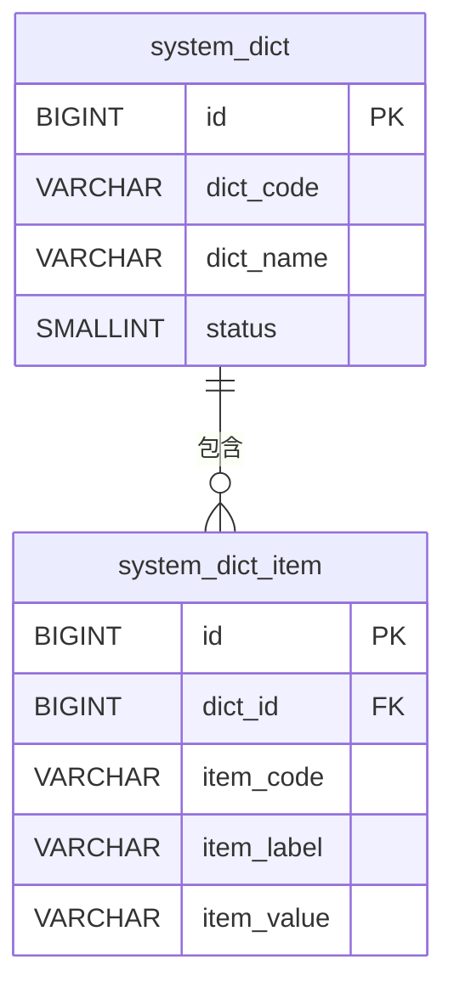

# qooerp-system 系统管理 - 数据设计文档

> 模块版本：1.0.0-SNAPSHOT
> 创建日期：2026-02-17
> 文档作者：QooERP团队

---

## 一、数据库概述

### 1.1 数据库信息

| 项目 | 值 |
|------|-----|
| 数据库名称 | qooerp_system |
| 数据库类型 | PostgreSQL 15+ |
| 字符集 | UTF8 |
| 排序规则 | zh_CN.UTF-8 |

### 1.2 表清单

| 序号 | 表名 | 中文名 | 说明 |
|------|------|--------|------|
| 1 | system_dict | 字典表 | 存储数据字典 |
| 2 | system_dict_item | 字典项表 | 存储字典明细项 |
| 3 | system_config | 系统参数表 | 存储系统配置参数 |
| 4 | system_log | 操作日志表 | 存储用户操作日志 |
| 5 | system_job | 定时任务表 | 存储定时任务信息 |
| 6 | system_job_log | 任务执行日志表 | 存储任务执行记录 |

---

## 二、数据表设计

### 2.1 system_dict 字典表

#### 2.1.1 表结构

| 序号 | 字段名 | 类型 | 长度 | 允许NULL | 默认值 | 主键 | 说明 |
|------|--------|------|------|----------|--------|------|------|
| 1 | id | BIGINT | 20 | NO | | YES | 字典ID |
| 2 | dict_name | VARCHAR | 100 | NO | | NO | 字典名称 |
| 3 | dict_code | VARCHAR | 100 | NO | | NO | 字典编码（唯一） |
| 4 | dict_type | VARCHAR | 100 | NO | | NO | 字典类型 |
| 5 | status | TINYINT | 1 | NO | 1 | NO | 状态：0-禁用 1-启用 |
| 6 | remark | VARCHAR | 500 | YES | | NO | 备注 |
| 7 | create_time | TIMESTAMP | | NO | CURRENT_TIMESTAMP | NO | 创建时间 |
| 8 | create_by | VARCHAR | 50 | YES | | NO | 创建人 |
| 9 | update_time | TIMESTAMP | | NO | CURRENT_TIMESTAMP | NO | 更新时间 |
| 10 | update_by | VARCHAR | 50 | YES | | NO | 更新人 |

#### 2.1.2 建表SQL

```sql
CREATE TABLE system_dict (
    id BIGSERIAL PRIMARY KEY,
    dict_name VARCHAR(100) NOT NULL,
    dict_code VARCHAR(100) NOT NULL,
    dict_type VARCHAR(100) NOT NULL,
    status SMALLINT NOT NULL DEFAULT 1,
    remark VARCHAR(500),
    create_time TIMESTAMP NOT NULL DEFAULT CURRENT_TIMESTAMP,
    create_by VARCHAR(50),
    update_time TIMESTAMP NOT NULL DEFAULT CURRENT_TIMESTAMP,
    update_by VARCHAR(50)
);

CREATE UNIQUE INDEX uk_system_dict_code ON system_dict(dict_code);
COMMENT ON TABLE system_dict IS '字典表';
```

---

### 2.2 system_dict_item 字典项表

#### 2.2.1 表结构

| 序号 | 字段名 | 类型 | 长度 | 允许NULL | 默认值 | 主键 | 说明 |
|------|--------|------|------|----------|--------|------|------|
| 1 | id | BIGINT | 20 | NO | | YES | 字典项ID |
| 2 | dict_id | BIGINT | 20 | NO | | NO | 字典ID |
| 3 | item_label | VARCHAR | 100 | NO | | NO | 字典项标签 |
| 4 | item_value | VARCHAR | 100 | NO | | NO | 字典项值 |
| 5 | item_code | VARCHAR | 100 | NO | | NO | 字典项编码 |
| 6 | sort | INT | 11 | YES | 0 | NO | 排序号 |
| 7 | status | TINYINT | 1 | NO | 1 | NO | 状态：0-禁用 1-启用 |
| 8 | remark | VARCHAR | 500 | YES | | NO | 备注 |

#### 2.2.2 建表SQL

```sql
CREATE TABLE system_dict_item (
    id BIGSERIAL PRIMARY KEY,
    dict_id BIGINT NOT NULL,
    item_label VARCHAR(100) NOT NULL,
    item_value VARCHAR(100) NOT NULL,
    item_code VARCHAR(100) NOT NULL,
    sort INTEGER DEFAULT 0,
    status SMALLINT NOT NULL DEFAULT 1,
    remark VARCHAR(500)
);

CREATE INDEX idx_system_dict_id ON system_dict_item(dict_id);
COMMENT ON TABLE system_dict_item IS '字典项表';
```

---

### 2.3 system_config 系统参数表

#### 2.3.1 表结构

| 序号 | 字段名 | 类型 | 长度 | 允许NULL | 默认值 | 主键 | 说明 |
|------|--------|------|------|----------|--------|------|------|
| 1 | id | BIGINT | 20 | NO | | YES | 参数ID |
| 2 | config_name | VARCHAR | 100 | NO | | NO | 参数名称 |
| 3 | config_key | VARCHAR | 100 | NO | | NO | 参数键（唯一） |
| 4 | config_value | VARCHAR | 500 | YES | | NO | 参数值 |
| 5 | config_type | VARCHAR | 20 | NO | | NO | 参数类型：string/number/boolean |
| 6 | is_system | TINYINT | 1 | NO | 0 | NO | 是否系统参数：0-否 1-是 |
| 7 | remark | VARCHAR | 500 | YES | | NO | 备注 |

#### 2.3.2 建表SQL

```sql
CREATE TABLE system_config (
    id BIGSERIAL PRIMARY KEY,
    config_name VARCHAR(100) NOT NULL,
    config_key VARCHAR(100) NOT NULL,
    config_value VARCHAR(500),
    config_type VARCHAR(20) NOT NULL,
    is_system SMALLINT NOT NULL DEFAULT 0,
    remark VARCHAR(500)
);

CREATE UNIQUE INDEX uk_system_config_key ON system_config(config_key);
COMMENT ON TABLE system_config IS '系统参数表';
```

---

### 2.4 system_log 操作日志表

#### 2.4.1 表结构

| 序号 | 字段名 | 类型 | 长度 | 允许NULL | 默认值 | 主键 | 说明 |
|------|--------|------|------|----------|--------|------|------|
| 1 | id | BIGINT | 20 | NO | | YES | 日志ID |
| 2 | user_id | BIGINT | 20 | YES | | NO | 用户ID |
| 3 | username | VARCHAR | 50 | YES | | NO | 用户名 |
| 4 | module | VARCHAR | 50 | YES | | NO | 模块名称 |
| 5 | operation | VARCHAR | 50 | YES | | NO | 操作类型 |
| 6 | method | VARCHAR | 200 | YES | | NO | 方法名称 |
| 7 | params | TEXT | | YES | | NO | 请求参数 |
| 8 | ip | VARCHAR | 50 | YES | | NO | 请求IP |
| 9 | location | VARCHAR | 100 | YES | | NO | 请求地点 |
| 10 | browser | VARCHAR | 50 | YES | | NO | 浏览器 |
| 11 | os | VARCHAR | 50 | YES | | NO | 操作系统 |
| 12 | status | TINYINT | 1 | NO | 0 | NO | 状态：0-失败 1-成功 |
| 13 | error_msg | VARCHAR | 500 | YES | | NO | 错误信息 |
| 14 | cost_time | INT | 11 | YES | | NO | 执行时间（毫秒） |
| 15 | operate_time | TIMESTAMP | | NO | CURRENT_TIMESTAMP | NO | 操作时间 |

#### 2.4.2 建表SQL

```sql
CREATE TABLE system_log (
    id BIGSERIAL PRIMARY KEY,
    user_id BIGINT,
    username VARCHAR(50),
    module VARCHAR(50),
    operation VARCHAR(50),
    method VARCHAR(200),
    params TEXT,
    ip VARCHAR(50),
    location VARCHAR(100),
    browser VARCHAR(50),
    os VARCHAR(50),
    status SMALLINT NOT NULL DEFAULT 0,
    error_msg VARCHAR(500),
    cost_time INTEGER,
    operate_time TIMESTAMP NOT NULL DEFAULT CURRENT_TIMESTAMP
);

CREATE INDEX idx_system_user_id ON system_log(user_id, operate_time);
CREATE INDEX idx_system_operate_time ON system_log(operate_time);
COMMENT ON TABLE system_log IS '操作日志表';
```

---

### 2.5 system_job 定时任务表

#### 2.5.1 表结构

| 序号 | 字段名 | 类型 | 长度 | 允许NULL | 默认值 | 主键 | 说明 |
|------|--------|------|------|----------|--------|------|------|
| 1 | id | BIGINT | 20 | NO | | YES | 任务ID |
| 2 | job_name | VARCHAR | 100 | NO | | NO | 任务名称 |
| 3 | job_group | VARCHAR | 100 | NO | | NO | 任务组 |
| 4 | job_class | VARCHAR | 200 | NO | | NO | 任务类名 |
| 5 | cron_expression | VARCHAR | 100 | NO | | NO | Cron表达式 |
| 6 | description | VARCHAR | 500 | YES | | NO | 任务描述 |
| 7 | status | TINYINT | 1 | NO | 0 | NO | 状态：0-暂停 1-运行中 |
| 8 | concurrent | TINYINT | 1 | NO | 1 | NO | 是否并发执行：0-否 1-是 |
| 9 | misfire_policy | TINYINT | 1 | NO | 1 | NO | 错过策略：1-立即执行 2-执行一次 3-放弃 |
| 10 | create_time | TIMESTAMP | | NO | CURRENT_TIMESTAMP | NO | 创建时间 |
| 11 | create_by | VARCHAR | 50 | YES | | NO | 创建人 |
| 12 | update_time | TIMESTAMP | | NO | CURRENT_TIMESTAMP | NO | 更新时间 |
| 13 | update_by | VARCHAR | 50 | YES | | NO | 更新人 |

#### 2.5.2 建表SQL

```sql
CREATE TABLE system_job (
    id BIGSERIAL PRIMARY KEY,
    job_name VARCHAR(100) NOT NULL,
    job_group VARCHAR(100) NOT NULL,
    job_class VARCHAR(200) NOT NULL,
    cron_expression VARCHAR(100) NOT NULL,
    description VARCHAR(500),
    status SMALLINT NOT NULL DEFAULT 0,
    concurrent SMALLINT NOT NULL DEFAULT 1,
    misfire_policy SMALLINT NOT NULL DEFAULT 1,
    create_time TIMESTAMP NOT NULL DEFAULT CURRENT_TIMESTAMP,
    create_by VARCHAR(50),
    update_time TIMESTAMP NOT NULL DEFAULT CURRENT_TIMESTAMP,
    update_by VARCHAR(50)
);

CREATE INDEX idx_system_job_group ON system_job(job_group);
COMMENT ON TABLE system_job IS '定时任务表';
```

---

## 三、初始化数据

### 3.1 默认字典数据

```sql
-- 插入默认字典
INSERT INTO system_dict (dict_name, dict_code, dict_type, create_by) VALUES
('用户状态', 'user_status', 'user', 'system'),
('字典状态', 'dict_status', 'system', 'system'),
('任务状态', 'job_status', 'system', 'system');

-- 插入字典项
INSERT INTO system_dict_item (dict_id, item_label, item_value, item_code, sort) VALUES
((SELECT id FROM system_dict WHERE dict_code = 'user_status'), '正常', '1', 'normal', 1),
((SELECT id FROM system_dict WHERE dict_code = 'user_status'), '禁用', '0', 'disable', 2);
```

### 3.2 默认系统参数

```sql
INSERT INTO system_config (config_name, config_key, config_value, config_type, is_system) VALUES
('系统名称', 'sys.name', 'QooERP', 'string', 1),
('系统版本', 'sys.version', '1.0.0', 'string', 1),
('会话超时时间（秒）', 'sys.session.timeout', '7200', 'number', 1);
```

---

## 四、数据关系

### 4.1 ER图



---

## 五、性能优化

### 5.1 索引优化

- 已为常用查询字段创建索引
- 定期VACUUM和ANALYZE

### 5.2 分区策略

`system_log` 表按月分区（可选）

---

## 六、参考资料

- [PostgreSQL官方文档](https://www.postgresql.org/docs/)
