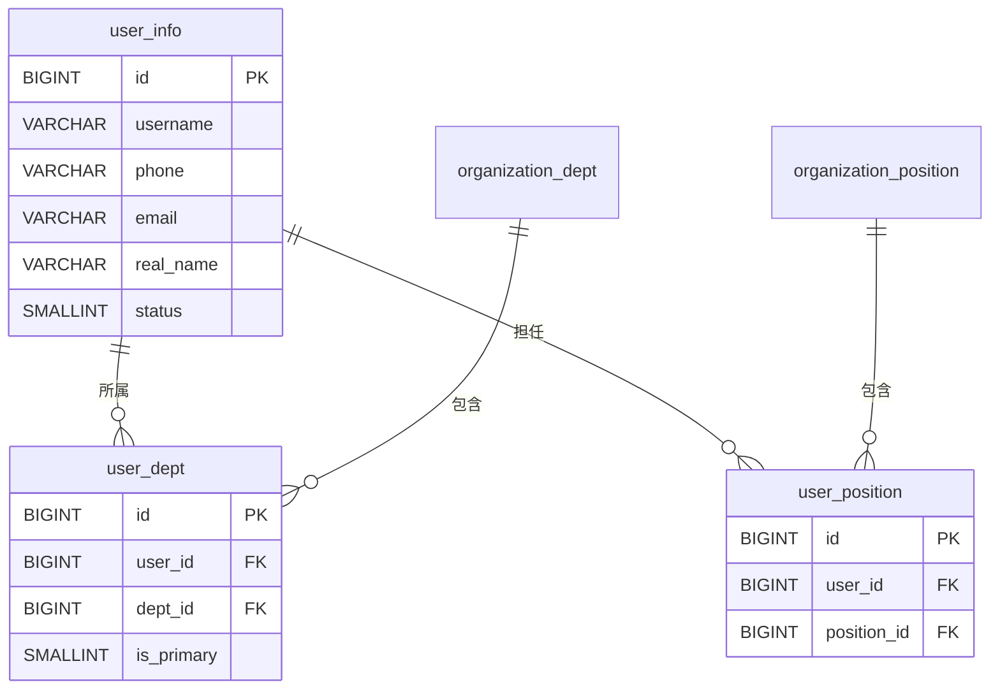

# qooerp-user 用户管理 - 数据设计文档

> 模块版本：1.0.0-SNAPSHOT
> 创建日期：2026-02-17
> 文档作者：QooERP团队

---

## 一、数据库概述

### 1.1 数据库信息

| 项目 | 值 |
|------|-----|
| 数据库名称 | qooerp_user |
| 数据库类型 | PostgreSQL 15+ |
| 字符集 | UTF8 |
| 排序规则 | zh_CN.UTF-8 |

### 1.2 表清单

| 序号 | 表名 | 中文名 | 说明 |
|------|------|--------|------|
| 1 | user_info | 用户信息表 | 存储用户基本信息 |
| 2 | user_dept | 用户部门关联表 | 用户与部门多对多关系 |
| 3 | user_position | 用户岗位关联表 | 用户与岗位多对多关系 |

---

## 二、数据表设计

### 2.1 user_info 用户信息表

#### 2.1.1 表结构

| 序号 | 字段名 | 类型 | 长度 | 允许NULL | 默认值 | 主键 | 说明 |
|------|--------|------|------|----------|--------|------|------|
| 1 | id | BIGINT | 20 | NO | | YES | 用户ID |
| 2 | tenant_id | BIGINT | 20 | YES | 0 | NO | 租户ID |
| 3 | username | VARCHAR | 50 | NO | | NO | 用户名（唯一） |
| 4 | phone | VARCHAR | 20 | YES | | NO | 手机号（唯一） |
| 5 | email | VARCHAR | 100 | YES | | NO | 邮箱（唯一） |
| 6 | real_name | VARCHAR | 50 | YES | | NO | 真实姓名 |
| 7 | nickname | VARCHAR | 50 | YES | | NO | 昵称 |
| 8 | avatar | VARCHAR | 500 | YES | | NO | 头像URL |
| 9 | gender | TINYINT | 1 | YES | 0 | NO | 性别：0-未知 1-男 2-女 |
| 10 | birthday | DATE | | YES | | NO | 生日 |
| 11 | status | TINYINT | 1 | NO | 1 | NO | 状态：0-禁用 1-启用 |
| 12 | remark | VARCHAR | 500 | YES | | NO | 备注 |
| 13 | create_time | TIMESTAMP | | NO | CURRENT_TIMESTAMP | NO | 创建时间 |
| 14 | create_by | VARCHAR | 50 | YES | | NO | 创建人 |
| 15 | update_time | TIMESTAMP | | NO | CURRENT_TIMESTAMP | NO | 更新时间 |
| 16 | update_by | VARCHAR | 50 | YES | | NO | 更新人 |
| 17 | deleted | TINYINT | 1 | NO | 0 | NO | 删除标记：0-未删除 1-已删除 |

#### 2.1.2 建表SQL

```sql
CREATE TABLE user_info (
    id BIGSERIAL PRIMARY KEY,
    tenant_id BIGINT NOT NULL DEFAULT 0,
    username VARCHAR(50) NOT NULL,
    phone VARCHAR(20),
    email VARCHAR(100),
    real_name VARCHAR(50),
    nickname VARCHAR(50),
    avatar VARCHAR(500),
    gender SMALLINT DEFAULT 0,
    birthday DATE,
    status SMALLINT NOT NULL DEFAULT 1,
    remark VARCHAR(500),
    create_time TIMESTAMP NOT NULL DEFAULT CURRENT_TIMESTAMP,
    create_by VARCHAR(50),
    update_time TIMESTAMP NOT NULL DEFAULT CURRENT_TIMESTAMP,
    update_by VARCHAR(50),
    deleted SMALLINT NOT NULL DEFAULT 0
);

CREATE UNIQUE INDEX uk_user_username ON user_info(username) WHERE deleted = 0;
CREATE UNIQUE INDEX uk_user_phone ON user_info(phone) WHERE deleted = 0;
CREATE UNIQUE INDEX uk_user_email ON user_info(email) WHERE deleted = 0;
COMMENT ON TABLE user_info IS '用户信息表';
```

---

### 2.2 user_dept 用户部门关联表

#### 2.2.1 表结构

| 序号 | 字段名 | 类型 | 长度 | 允许NULL | 默认值 | 主键 | 说明 |
|------|--------|------|------|----------|--------|------|------|
| 1 | id | BIGINT | 20 | NO | | YES | 主键ID |
| 2 | user_id | BIGINT | 20 | NO | | NO | 用户ID |
| 3 | dept_id | BIGINT | 20 | NO | | NO | 部门ID |
| 4 | is_primary | TINYINT | 1 | NO | 0 | NO | 是否主部门：0-否 1-是 |

#### 2.2.2 建表SQL

```sql
CREATE TABLE user_dept (
    id BIGSERIAL PRIMARY KEY,
    user_id BIGINT NOT NULL,
    dept_id BIGINT NOT NULL,
    is_primary SMALLINT NOT NULL DEFAULT 0
);

CREATE UNIQUE INDEX uk_user_dept ON user_dept(user_id, dept_id);
CREATE INDEX idx_user_id ON user_dept(user_id);
COMMENT ON TABLE user_dept IS '用户部门关联表';
```

---

### 2.3 user_position 用户岗位关联表

#### 2.3.1 表结构

| 序号 | 字段名 | 类型 | 长度 | 允许NULL | 默认值 | 主键 | 说明 |
|------|--------|------|------|----------|--------|------|------|
| 1 | id | BIGINT | 20 | NO | | YES | 主键ID |
| 2 | user_id | BIGINT | 20 | NO | | NO | 用户ID |
| 3 | position_id | BIGINT | 20 | NO | | NO | 岗位ID |

#### 2.3.2 建表SQL

```sql
CREATE TABLE user_position (
    id BIGSERIAL PRIMARY KEY,
    user_id BIGINT NOT NULL,
    position_id BIGINT NOT NULL
);

CREATE UNIQUE INDEX uk_user_position ON user_position(user_id, position_id);
CREATE INDEX idx_user_position_user_id ON user_position(user_id);
COMMENT ON TABLE user_position IS '用户岗位关联表';
```

---

## 三、初始化数据

```sql
-- 插入默认用户（admin用户）
INSERT INTO user_info (
    tenant_id, username, real_name, nickname, status, create_by, update_by
) VALUES (
    0,
    'admin',
    '系统管理员',
    '超级管理员',
    1,
    'system',
    'system'
);

-- 为admin用户分配默认部门
INSERT INTO user_dept (user_id, dept_id, is_primary)
SELECT 1, id, 1 FROM organization_dept WHERE dept_code = 'HEADQUARTERS';
```

---

## 四、数据关系



---

## 五、参考资料

- [PostgreSQL官方文档](https://www.postgresql.org/docs/)
